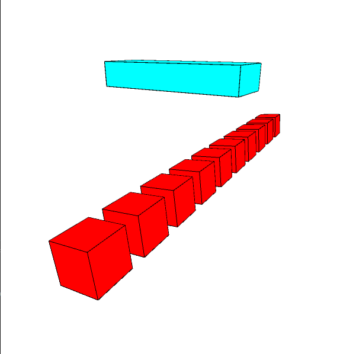
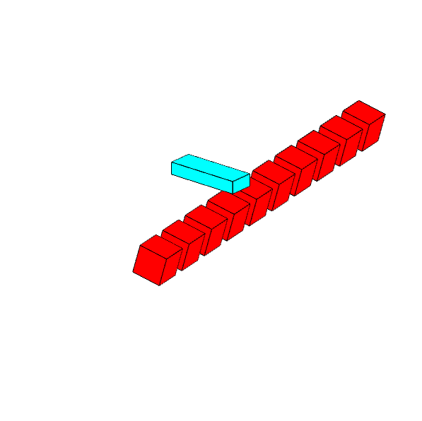
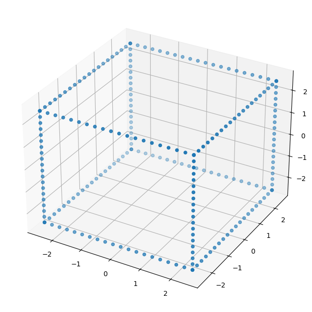
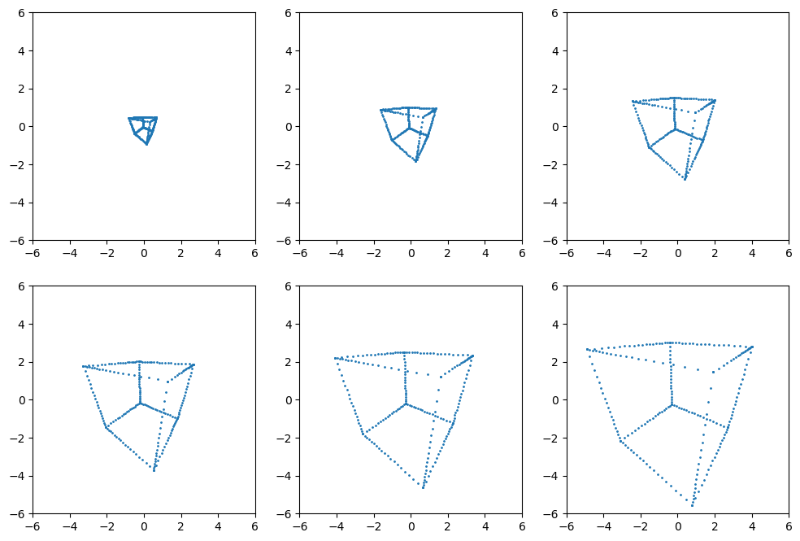
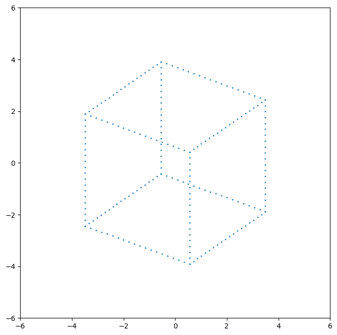
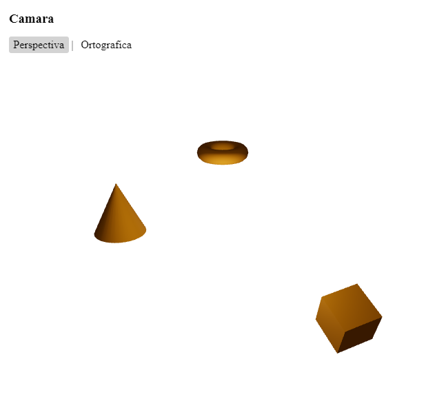
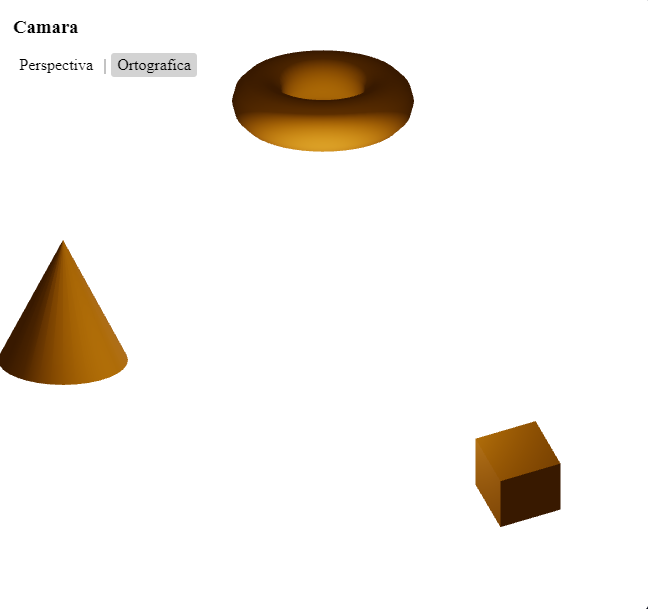

# Espacios Proyectivos y Matrices de Proyección

Transformaciones y proyecciones en computación visual usando Processing, Python y Three.js.

## Processing
Transformaciones, rotaciones y proyecciones de cubos en 3D.

Se utiliza `pushMatrix` y `popMatrix` para aislar las transformaciones de cada objeto. Se alterna entre proyección ortográfica y perspectiva con clic del mouse.

Transformación global:
```java
  rotateX(-PI/8);
```
Transformaciones y animación en objetos discretos:
```java
  pushMatrix();
    // Translate to lower left corner of the screen
    translate(width/6, 7*height/8, 0);
    
    // Position reference frame
    rotateY(-PI/6);
    
    // Rotate animation
    rotateZ(PI*sin((float)millis()/1000.0));
    
    //set box color to red
    fill(255,0,0);
    
    // draw red boxes
    for(int i = 0; i < 10; i++){
      // draw boxes
      box(120);

      //translate back
      translate(0,0,-170);
    }
  popMatrix();
```

Se puede alternar entre proyección perspectiva y ortográfica haciendo clic en la ventana.

```java
void mouseClicked() {
  usePerspective = !usePerspective;
  if (usePerspective) {
    perspective(PI/3, 1, 1, 10000);
  } else {
    ortho(-800, 800, -800, 800, 1, 10000);
  }
}
```


vista en perspectiva




El sketch se puede correr con el archivo de [Processing](./processing/processing.pde)

## Python
Transformaciones y proyecciones de un cubo en 3D usando matrices homogéneas.

se crean puntos de forma que se pueda apreciar un cubo.



y funciones para generar matrices de traslación, rotación, escalado y proyección, así como para aplicar estas matrices a los vértices de un cubo.

```python
# Matriz de traslación
# x, y, z son los desplazamientos

def tranMatrix(x,y,z):
    return np.array([[1,0,0,x],
                     [0,1,0,y],
                     [0,0,1,z],
                     [0,0,0,1]])

# Matriz de rotación en X
# angle es el ángulo en radianes

def rotXMatrix(angle):
    return np.array([[1,            0,             0,0],
                     [0,np.cos(angle),-np.sin(angle),0],
                     [0,np.sin(angle), np.cos(angle),0],
                     [0,            0,             0,1]])

# Matriz de proyección perspectiva

def make_projection(points, d=1.0):
  P = np.array([
    [1, 0, 0, 0],
    [0, 1, 0, 0],
    [0, 0, 1, 0],
    [0, 0, 1/d, 0]
  ])
  proy = applyMatrix(P, points)
  return proy

# Matriz de proyección ortografica

def make_orthographic(points):
ortho = np.array([
  [1, 0, 0, 0],
  [0, 1, 0, 0],
  [0, 0, 1, 0],
  [0, 0, 0, 1]
])
proy = applyMatrix(ortho, points)
return proy
```

Se aplican distintas matrices de proyección y se grafican los resultados en subplots para comparar la proyección ortográfica y varias perspectivas (distancia de foco de 1 a 6 de izquierda a derecha).

perspectiva



ortografica




El código y visualizaciones están en el [notebook de Jupyter](./python/espacios_proyectivos.ipynb).

## Three.js
Transformaciones y proyecciones de figuras 3D usando cámaras ortográfica y perspectiva.

Se crea una escena con tres figuras (cubo, cono y toroide) y se permite alternar entre cámara perspectiva y ortográfica desde la interfaz.

```jsx
function MyMesh() {
  return (
    <>
    <group rotation={[Math.PI/8,0,0]} position={[0,-3,0]}>
      <mesh position={[3,0,-1]} rotation={[Math.PI/8,Math.PI/8,0]}>
        <boxGeometry args={[1,1,1]}/>
        <meshStandardMaterial color="orange" />
      </mesh>
      <mesh position={[-4,0,-8]}>
        <coneGeometry args={[1,2]}/>
        <meshStandardMaterial color="orange" />
      </mesh>
      <mesh position={[0,0,-16]} rotation={[Math.PI/2,0,0]}>
        <torusGeometry args={[]}/>
        <meshStandardMaterial color="orange" />
      </mesh>
    </group>
    </>
  );
}

function App() {
  const [proj, setProj] = useState(true);
  return (
    <div id="root" style={{ width: "100vw", height: "100vh" }}>
      <div id="controls"> ... </div>
      <Canvas>
        <MyMesh/>
        <ambientLight intensity={0.2} />
        <pointLight position={[0,0,-4]} intensity={15}/>
        <pointLight position={[0,0,-12]} intensity={15}/>
        <pointLight position={[0,0,0]}  intensity={15}/>
        {proj? <PerspectiveCamera makeDefault position={[0,0,10]}/>: <OrthographicCamera makeDefault zoom={65}/>} 
        <OrbitControls makeDefault/>
      </Canvas>
    </div>
  );
}
```
Se puede alternar entre los dos tipos de cámara haciendo clic en la interfaz que indica el tipo de camara en uso.

perspectiva



ortografica




El código se encuentra en [App.jsx](./threejs/src/App.jsx) y se puede correr con los comandos:
```sh
cd threejs
npm install
npm run dev
```
