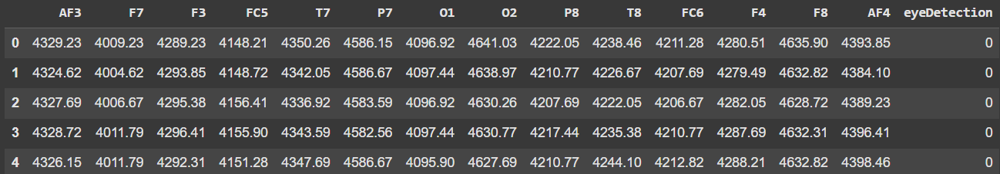
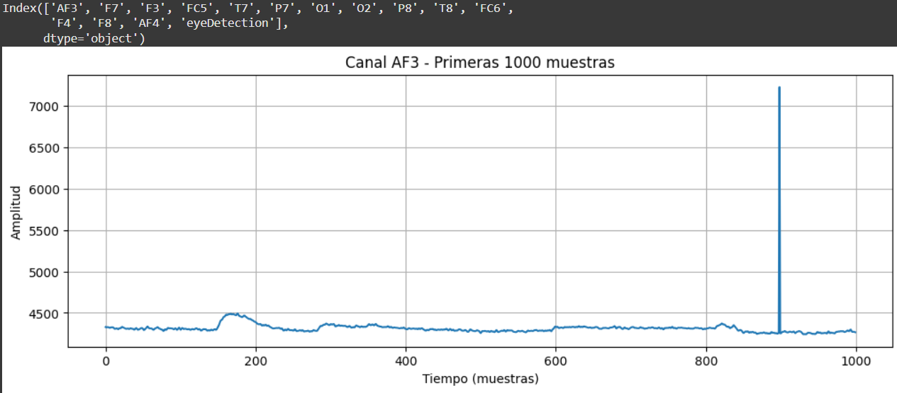
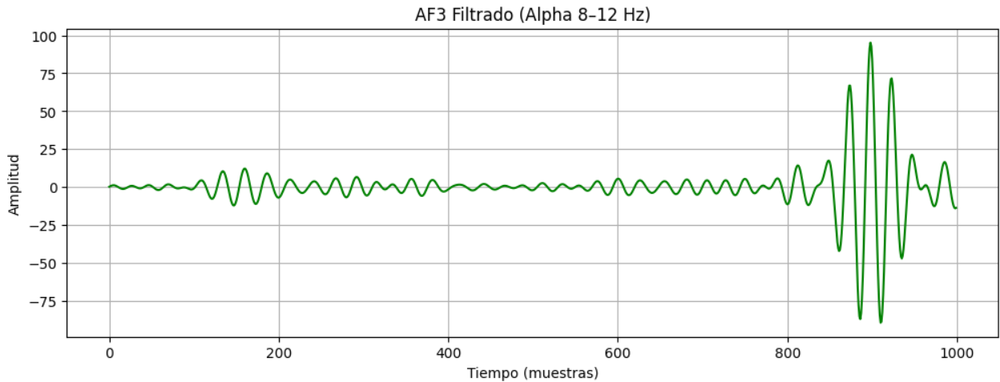
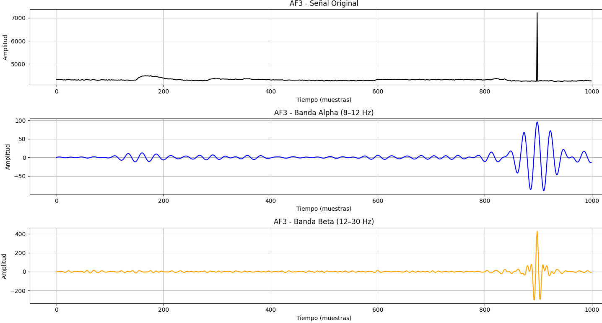
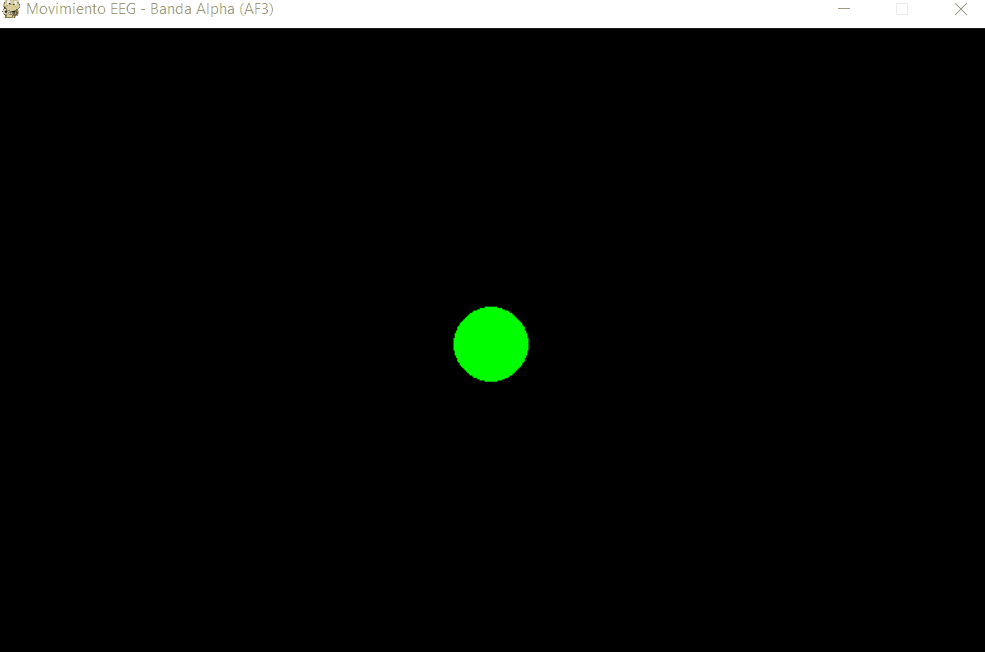

# 2025-05-31_Taller_bci_simulado_control_visual

## Python

En este taller se trabajó con señales EEG del dataset **EEG Eye State** utilizando técnicas básicas de análisis de datos fisiológicos en Python. Se inició con la carga y visualización de una señal cruda desde el canal AF3. Luego, se aplicaron filtros pasa banda para extraer las bandas **Alpha (8–12 Hz)** y **Beta (12–30 Hz)**. Posteriormente, se calculó la potencia en la banda Alpha para estimar el nivel de atención del sujeto. También se realizó una comparación gráfica entre la señal original y las bandas filtradas. Finalmente, se diseñó una visualización animada utilizando `pygame`, donde una esfera cambia su posición en función del nivel de actividad filtrada por banda Alpha.

## Pasos

1. **Cargar el dataset EEG desde ucimlrepo**  
   - Se utiliza el módulo `ucimlrepo` para acceder al dataset "EEG Eye State".  
   - Los datos se almacenan en un `DataFrame` de `pandas` y se guarda una copia como archivo CSV para facilitar su reutilización.

2. **Visualizar la señal EEG de un canal específico**  
   - Se selecciona el canal **AF3** de las señales EEG.  
   - Se grafican las primeras muestras usando `matplotlib` para observar la forma de onda original y su comportamiento general.

3. **Aplicar un filtro para extraer la banda Alpha (8–12 Hz)**  
   - Se implementa un filtro pasa banda con `scipy.signal` para aislar las frecuencias de la banda Alpha.  
   - Se grafica la señal filtrada para observar la actividad correspondiente al rango Alpha.

4. **Estimar el nivel de atención usando potencia Alpha**  
   - Se calcula la densidad espectral de potencia de la señal filtrada con el método de Welch (`scipy.signal.welch`).  
   - Se define un umbral para clasificar si el sujeto está en un estado de atención alta o baja.  
   - Se visualiza el resultado mediante un recuadro de color (verde para alta atención, rojo para baja).

5. **Comparar gráficamente las bandas Alpha y Beta**  
   - Se aplica un segundo filtro pasa banda para la banda **Beta (12–30 Hz)**.  
   - Se comparan en una misma gráfica la señal original, la señal Alpha y la señal Beta para observar diferencias en frecuencia y amplitud en una sola imagen.

6. **Simular una visualización con pygame**  
   - Se construye una animación donde una esfera se mueve verticalmente según la potencia de la banda Alpha.  
   - La animación se genera en tiempo simulado usando `pygame`, como representación visual del estado atencional.

---

## Resultados

```python
!pip install ucimlrepo

from ucimlrepo import fetch_ucirepo

# Cargar el dataset EEG Eye State
eeg_eye_state = fetch_ucirepo(id=264)

# Extraer datos y etiquetas
X = eeg_eye_state.data.features  # Señales EEG
y = eeg_eye_state.data.targets   # Estado de ojos (0=cerrado, 1=abierto)

import pandas as pd

# Combinar en un solo DataFrame
df = pd.concat([X, y], axis=1)

# Guardar como CSV
df.to_csv("eeg_eye_state.csv", index=False)

# Mostrar los primeros registros
df.head()
```
---



---

```python
import pandas as pd
import matplotlib.pyplot as plt

# Cargar el archivo CSV
df = pd.read_csv('eeg_eye_state.csv')

# Ver columnas disponibles
print(df.columns)

# Visualizar la señal
plt.figure(figsize=(12, 4))
plt.plot(df['AF3'][:1000])  # Solo las primeras 1000 muestras
plt.title('Canal AF3 - Primeras 1000 muestras')
plt.xlabel('Tiempo (muestras)')
plt.ylabel('Amplitud')
plt.grid(True)
plt.show()
```
---



---

```python
from scipy.signal import butter, filtfilt

def butter_bandpass(lowcut, highcut, fs, order=5):
    nyq = 0.5 * fs
    low = lowcut / nyq
    high = highcut / nyq
    b, a = butter(order, [low, high], btype='band')
    return b, a

def bandpass_filter(data, lowcut, highcut, fs, order=5):
    b, a = butter_bandpass(lowcut, highcut, fs, order=order)
    y = filtfilt(b, a, data)
    return y

# Parámetros del filtro
fs = 250  # Hz (frecuencia de muestreo estimada)
lowcut = 8
highcut = 12

# Aplicar filtro a EEG 1
eeg_raw = df['AF3'].values
eeg_filtered = bandpass_filter(eeg_raw, lowcut, highcut, fs)

# Graficar filtrado
plt.figure(figsize=(12, 4))
plt.plot(eeg_filtered[:1000], color='green')
plt.title('AF3 Filtrado (Alpha 8–12 Hz)')
plt.xlabel('Tiempo (muestras)')
plt.ylabel('Amplitud')
plt.grid(True)
plt.show()
```
---



---

```python
from scipy.signal import welch
import numpy as np

# Calcular densidad espectral de potencia (PSD)
frequencies, power_spectrum = welch(eeg_alpha, fs=fs, nperseg=1024)

# Potencia en banda Alpha
alpha_band = (frequencies >= 8) & (frequencies <= 12)
alpha_power = np.sum(power_spectrum[alpha_band])

# Umbral arbitrario para "nivel de atención"
attention_threshold = 1e-5
attention = alpha_power > attention_threshold

print(f"Potencia Alpha: {alpha_power:.6f}")
print("Nivel de atención:", "ALTO" if attention else "BAJO")

import matplotlib.patches as patches

# Color: verde si hay atención, rojo si no
color = 'green' if attention else 'red'

# Simulación visual: ventana con color
fig, ax = plt.subplots(figsize=(4, 4))
rect = patches.Rectangle((0, 0), 1, 1, facecolor=color)
ax.add_patch(rect)
plt.xlim([0, 1])
plt.ylim([0, 1])
plt.axis('off')
plt.title("Atención ALTA" if attention else "Atención BAJA")
plt.show()
```
---


---

```python
import pandas as pd
import matplotlib.pyplot as plt
from scipy.signal import butter, filtfilt

# Cargar el archivo CSV
df = pd.read_csv('eeg_eye_state.csv')

# Ver columnas disponibles
print(df.columns)

# --- Filtro pasa banda ---
def butter_bandpass(lowcut, highcut, fs, order=5):
    nyq = 0.5 * fs
    low = lowcut / nyq
    high = highcut / nyq
    b, a = butter(order, [low, high], btype='band')
    return b, a

def bandpass_filter(data, lowcut, highcut, fs, order=5):
    b, a = butter_bandpass(lowcut, highcut, fs, order=order)
    y = filtfilt(b, a, data)
    return y

# Parámetros generales
fs = 250  # Hz (frecuencia de muestreo estimada)
eeg_raw = df['AF3'].values  #cambiar a cualquier otra

# --- Filtrar banda Alpha (8–12 Hz) ---
alpha_filtered = bandpass_filter(eeg_raw, lowcut=8, highcut=12, fs=fs)

# --- Filtrar banda Beta (12–30 Hz) ---
beta_filtered = bandpass_filter(eeg_raw, lowcut=12, highcut=30, fs=fs)

# --- Graficar señales ---
plt.figure(figsize=(15, 8))

plt.subplot(3, 1, 1)
plt.plot(eeg_raw[:1000], color='black')
plt.title('AF3 - Señal Original')
plt.xlabel('Tiempo (muestras)')
plt.ylabel('Amplitud')
plt.grid(True)

plt.subplot(3, 1, 2)
plt.plot(alpha_filtered[:1000], color='blue')
plt.title('AF3 - Banda Alpha (8–12 Hz)')
plt.xlabel('Tiempo (muestras)')
plt.ylabel('Amplitud')
plt.grid(True)

plt.subplot(3, 1, 3)
plt.plot(beta_filtered[:1000], color='orange')
plt.title('AF3 - Banda Beta (12–30 Hz)')
plt.xlabel('Tiempo (muestras)')
plt.ylabel('Amplitud')
plt.grid(True)

plt.tight_layout()
plt.show()
```
---



---

```python
import pandas as pd
import numpy as np
from scipy.signal import butter, filtfilt
import pygame
from ucimlrepo import fetch_ucirepo

# === 1. Cargar el dataset desde ucimlrepo ===
eeg_eye_state = fetch_ucirepo(id=264)
X = eeg_eye_state.data.features  # señales EEG
df = X.copy()

# === 2. Elegir canal EEG y filtrar banda Alpha (8–12 Hz) ===
fs = 250  # Frecuencia de muestreo estimada
eeg_raw = df['O1'].values[:2000]  # usamos las primeras 2000 muestras

def butter_bandpass(lowcut, highcut, fs, order=5):
    nyq = 0.5 * fs
    low = lowcut / nyq
    high = highcut / nyq
    return butter(order, [low, high], btype='band')

def bandpass_filter(data, lowcut, highcut, fs, order=5):
    b, a = butter_bandpass(lowcut, highcut, fs, order=order)
    return filtfilt(b, a, data)

# Filtrar en banda Alpha
eeg_filtered = bandpass_filter(eeg_raw, 8, 12, fs)

# Normalizar y escalar a coordenadas de pantalla
eeg_norm = (eeg_filtered - np.min(eeg_filtered)) / (np.max(eeg_filtered) - np.min(eeg_filtered))
eeg_scaled = 400 - eeg_norm * 300  # Mapea a rango visual (de 100 a 400 px)

# === 3. Inicializar pygame ===
pygame.init()
width, height = 800, 500
screen = pygame.display.set_mode((width, height))
pygame.display.set_caption("Movimiento EEG - Banda Alpha (AF3)")
clock = pygame.time.Clock()

# === 4. Bucle de animación ===
index = 0
running = True
while running and index < len(eeg_scaled):
    for event in pygame.event.get():
        if event.type == pygame.QUIT:
            running = False

    y_pos = int(eeg_scaled[index])
    index += 1

    screen.fill((0, 0, 0))  # fondo negro
    pygame.draw.circle(screen, (0, 255, 0), (width // 2, y_pos), 30)

    pygame.display.flip()
    clock.tick(60)  # 60 cuadros por segundo

pygame.quit()
```
---



---

## Comentarios

Este taller sirvió como un pequeño acercamiento a los conceptos teóricos de neurociencia con técnicas prácticas de procesamiento de señales en Python. Aprendí a aplicar filtros digitales para extraer bandas de frecuencia específicas y comprendí mejor cómo se relacionan estas bandas (como Alpha y Beta) con estados cognitivos como la "atención". La lógica de simulación en `pygame` fue bastante simple, el circulo se mueve segun la señal y con ello se pudo visualizar dinámicamente el comportamiento de esta.

Las principales dificultades fueron: entender cada tipo de señal y lo que se supone que representan, diseñar los filtros pasa banda, así como interpretar los valores de potencia resultantes para determinar el nivel de atención. También me costó un poco integrar `pygame` ya que Colab no puede usar este tipo de librerias.

