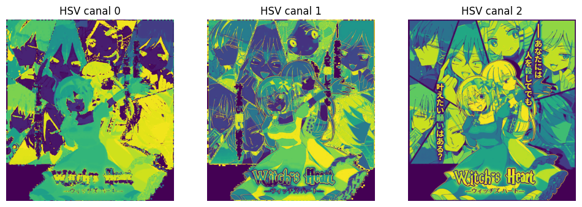

# 🎨 Taller - Explorando el Color: Percepción Humana y Modelos Computacionales

## 🧠 Objetivo

Explorar cómo distintos modelos de color afectan la percepción visual humana y cómo se simulan condiciones visuales alteradas, como el daltonismo, usando herramientas computacionales.

---

## 📘 Modelos de color utilizados

- **RGB (Red, Green, Blue):** Modelo aditivo usado en pantallas. Representa colores como combinaciones de luz.
- **HSV (Hue, Saturation, Value):** Modelo más cercano a cómo percibimos los colores; separa el matiz, la intensidad del color y el brillo.
- **CIE Lab:** Modelo perceptualmente uniforme, diseñado para que distancias entre colores representen diferencias reales en percepción.

---

## 📘 Eleccion de imagen

Se escogió una imagen con multiples tonos de colores con el fin de hacer las representaciones adecuadas para cada situación, la del presente trabajo es del juego Witch's heart


---

## 🔁 Conversión entre espacios de color

Se cargó una imagen y se transformó a HSV y CIE Lab. A continuación, se visualizaron sus canales individuales para comprender cómo se distribuye la información de color en cada modelo.




---

## 👓 Simulación de alteraciones en la visión

Se aplicaron transformaciones para simular dos tipos de daltonismo:

### Protanopía (ausencia de conos rojos)

Los colores rojos pierden saturación, y tonalidades cálidas (rojo, magenta, naranja) se vuelven apagadas o amarillentas.

### Deuteranopía (ausencia de conos verdes)

Los verdes se vuelven más apagados y el contraste entre verdes y rojos disminuye, aunque el rojo aún debería ser visible (con menor precisión).

### Tritanopía (ausencia de conos azules)

Los azules se ven apagados o verdosos, y los colores amarillos pueden parecer rosados o grises. El contraste entre azul y verde se reduce notablemente.

---

## 📘 Metodología

Se implementaron 2 metodos:

### simular_daltonismo()

Utiliza matrices de transformación lineal específicas para cada tipo

Está basado en investigación científica, trata sobre transformaciones lineales consistentes y es computacionalmente eficiente

### simular_daltonismo_alternativo()

Reemplaza canales de color problemáticos con combinaciones de otros canales

Diferencias más evidentes entre tipos, mejor para propósitos educativos y realiza simulaciones más contrastantes

---

## 📷 Comparación visual

Se usó una imagen con una amplia gama de colores (rojos, verdes, azules, magentas) para comprobar cómo cada simulación afecta la percepción del color.


---

## 💬 Reflexión

Este ejercicio demuestra cómo diferentes representaciones del color influyen en nuestra percepción visual. Entender estas diferencias es esencial en el diseño gráfico, interfaces accesibles, y en la creación de contenido visual que considere a usuarios con deficiencias visuales.

---

## 🛠️ Herramientas utilizadas

- Python
- OpenCV
- Matplotlib
- NumPy

---

## 📁 Estructura del repositorio

```
2025-05-31_taller_modelos_color_percepcion/
├── README.md
├── Comparacion_daltonismo_1.png
├── Comparacion_daltonismo_2.png
├── Comparacion_canales_1.png
├── Comparacion_canales_2.png
├── Witchs_heart.png
└── python/
    └── Taller_modelos_color_percepcion.ipynb
```