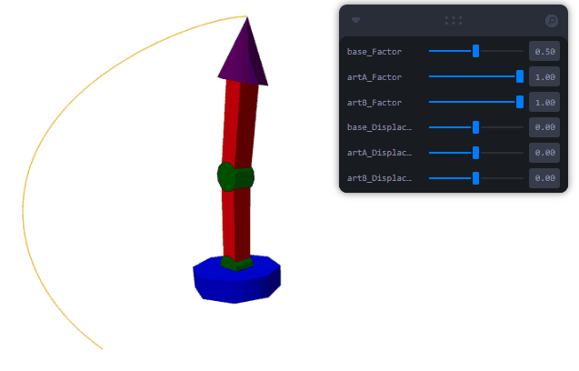

# Taller - Cinemática Directa: Animando Brazos Robóticos o Cadenas Articuladas

Este proyecto implementa una simulación interactiva de un brazo robótico de dos eslabones usando Three.js y React Three Fiber. Permite explorar conceptos de cinemática directa, visualizando la trayectoria del extremo del brazo y controlando los ángulos de sus articulaciones en tiempo real.

## Descripción de la Escena

La escena contiene:
- Un brazo robótico con base giratoria y dos segmentos articulados (artA y artB).
- El extremo del brazo deja una traza que muestra su trayectoria en el espacio.
- Controles interactivos (Leva) para modificar los factores de animación y desplazamiento angular de cada articulación.

### Componentes principales

#### Brazo Robótico (`Arm`)
- **Base**: Cilindro azul que rota sobre el eje Y.
- **Articulación A**: Primer segmento (verde y rojo), rota sobre el eje Z.
- **Articulación B**: Segundo segmento (verde y rojo), también rota sobre el eje Z.
- **Extremo (tip)**: Cono púrpura que representa la "mano" del brazo.
- **Traza**: Línea naranja que sigue la posición del extremo durante la animación.

La animación de cada articulación depende del tiempo y de los parámetros `factor` y `displacement`, que se pueden ajustar en tiempo real.

#### Controles Interactivos
Se utilizan controles de la librería Leva para modificar:
- **Factor**: Escala la amplitud de movimiento de cada articulación.
- **Displacement**: Desplazamiento angular fijo de cada articulación.

### Codigo de cinematicas directas

```jsx
baseRef.current.rotation.y = Math.sin(t) * Math.PI * (factor.base ?? 1) + (displacement.base ?? 0);

artARef.current.rotation.z = clamp(Math.sin(t) * Math.PI * 0.25 * (factor.artA ?? 1) + (displacement.artA ?? 0), -Math.PI/4, Math.PI/4);

artBRef.current.rotation.z = clamp(Math.sin(t) * Math.PI * 0.5 * (factor.artB ?? 1) + (displacement.artB ?? 0), -Math.PI/2, Math.PI/2);

```

### Ejemplo de pantalla


### Ejemplo de uso

```sh
cd threejs
npm install
npm run dev
```

Luego, abre el navegador en la dirección indicada por Vite para interactuar con la simulación.


### Código relevante
El código principal se encuentra en [`App.jsx`](./threejs/src/App.jsx). La función `Arm` define la estructura y animación del brazo, mientras que el componente principal `App` gestiona los controles y la escena.

---

Esta simulación es útil para visualizar y comprender la cinemática directa de sistemas robóticos articulados, permitiendo experimentar con diferentes configuraciones de movimiento y observar el efecto en la trayectoria del extremo del brazo.
