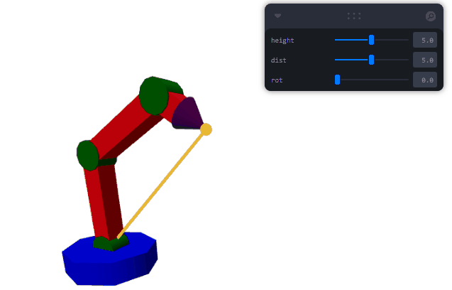

# Taller - Cinemática Inversa: Haciendo que el Modelo Persiga Objetivos

Exploración de técnicas de cinemática inversa aplicadas a un brazo robótico articulado usando Three.js y React Three Fiber. Se utiliza el algoritmo FABRIK para calcular las posiciones articulares necesarias para alcanzar un objetivo en el espacio.

## Three.js

Se implementa una escena interactiva con:
- Un brazo robótico de tres segmentos, cuyas articulaciones se ajustan automáticamente para alcanzar un objetivo.
- El objetivo puede ser manipulado en altura, distancia y rotación mediante controles interactivos (Leva).
- Una línea naranja conecta la base del brazo con el objetivo, y una esfera marca la posición objetivo.

El algoritmo FABRIK (Forward And Backward Reaching Inverse Kinematics) se utiliza para resolver la cinemática inversa en 3D, proyectando el problema a 2D para simplificar los cálculos y luego aplicando los ángulos resultantes a las articulaciones del brazo.

### Algoritmo FABRIK
- Convierte el problema 3D a 2D (plano YL) para simplificar la resolución.
```js
function FABRIK3DTo2DTargletYL(target, base){
  const toTarget3D = target.clone().sub(base)
  const toTargetZX = new THREE.Vector2(toTarget3D.x, toTarget3D.z)
  
  // creates toTarget vector projected on a plane that could be described as having a normal
  // ortogonal to both the toTarget and Y basis vectors
  // (you could do a plane projection and use cross product to get this normal, but why bother)
  const toTargetYL = new THREE.Vector2(toTargetZX.length(), toTarget3D.y);
  
  return [toTargetZX.angle(), toTargetYL]
}
```
- Calcula iterativamente las posiciones de las articulaciones para que el extremo del brazo alcance el objetivo.
```js
let nPositions = Array.from(positions);
for(let i = 0; i < 5; i++){
  nPositions = FABRIK2DIter(target, nPositions);
  nPositions = FABRIK2DIter(start, nPositions);
}
```
- Ajusta los ángulos de cada articulación en tiempo real según la posición objetivo.


```jsx
function Arm(props) {
  // ...
  useFrame((state, delta) => {
    const t = state.clock.getElapsedTime();
    if(props.target){
      const nState = ArmFabrik(props.target, refs[0].current.position, lengths);
      refs[0].current.rotation.y = nState.base;
      for(let i = 0; i < nState.angles.length; i++){
        refs[i + 1].current.rotation.z = nState.angles[i];
      }
    }
  })
  // ...
}
```
### Estructura de la escena (resumido)
```jsx
export default function App() {
  // ...
  <Canvas>
    {/* ... */}
    <Arm target={new THREE.Vector3(dist*Math.cos(rot),height,dist*Math.sin(rot))}/>
    <Line points={[[0,0,0],[dist*Math.cos(rot),height,dist*Math.sin(rot)]]} color={"orange"} lineWidth={5}/>
    <mesh position={[dist*Math.cos(rot),height,dist*Math.sin(rot)]}>
      <sphereGeometry args={[0.2]}/>
      <meshBasicMaterial color={"orange"}/>
    </mesh>
    <OrbitControls makeDefault/>
  </Canvas>
  // ...
}
```

### Demostración



El código principal está en [`App.jsx`](./threejs/src/App.jsx). Para ejecutar la escena:

```sh
cd threejs
npm install
npm run dev
```

Luego abre el navegador en la dirección indicada por Vite para interactuar con la simulación y experimentar con la cinemática inversa del brazo robótico.

---

Esta simulación permite visualizar y comprender el funcionamiento de la cinemática inversa en sistemas robóticos, mostrando cómo el brazo ajusta sus articulaciones para alcanzar cualquier objetivo dentro de su alcance.