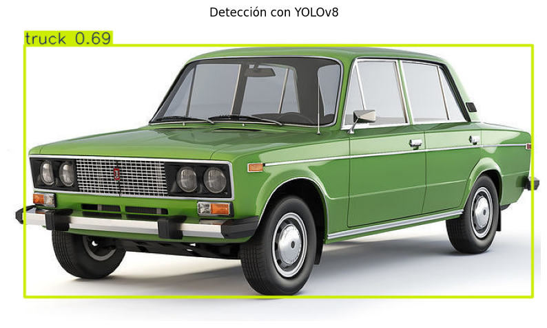
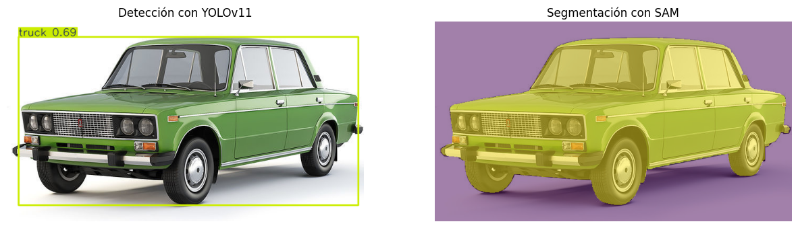
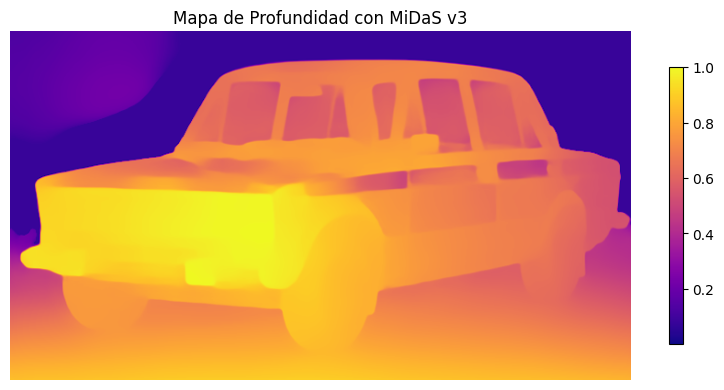
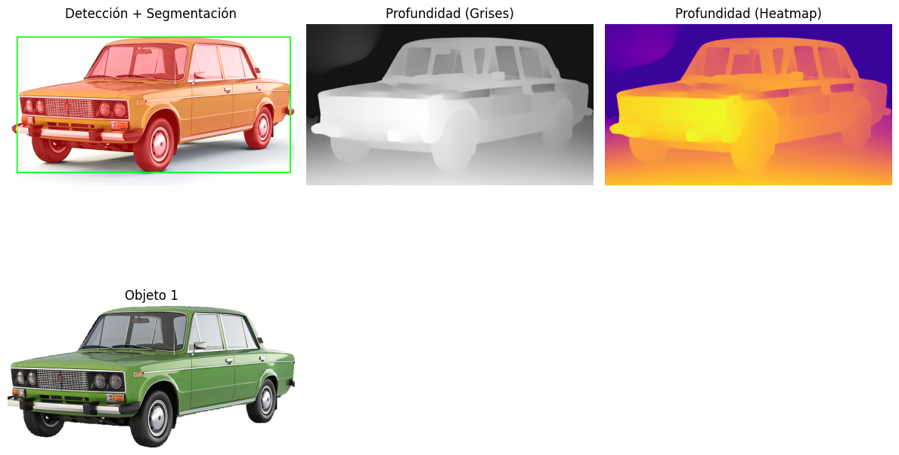

# Práctica 1 – Pipeline YOLO + SAM + MiDaS

 
**Presentado por: [Grupo #7]**

- David Santiago Cruz Hernandez: dcruzhe@unal.edu.co
- Sergio Alejandro Reita Serrano: sreita@unal.edu.co
- Juan Sebastian Rodriguez Chiquiza: jurodriguezch@unal.edu.co
- Fabian Humberto Chaparro Aguilera: fchaparroa@unal.edu.co

**Asignatura:** Computación visual

**Fecha:** 19 de julio de 2025

---

## 1. Objetivos 🎯

- Integrar tres modelos preentrenados (YOLOv8, SAM, MiDaS) en un único pipeline.
- Detectar objetos, segmentarlos y estimar su profundidad en una imagen.
- Evaluar la sinergia entre detección, segmentación precisa y estimación de profundidad.

---

## 2. Estructura del pipeline 🧩

```
Imagen → YOLOv8 → cajas (bounding boxes)
                ↓
     puntos/bboxes → SAM → máscaras segmentadas
                ↓
          Imagen → MiDaS → mapa de profundidad
```

- **YOLOv8**: detección rápida con bounding boxes, clases y scores.  
- **SAM (Segment Anything Model)**: segmentación precisa usando las cajas detectadas por YOLO.  
- **MiDaS**: modelo monocular para estimar la profundidad por píxel.

---

## 3. Metodología ⚙️

### 3.1. Carga de modelos 🧠📦

```python
from ultralytics import YOLO
from segment_anything import SamPredictor, sam_model_registry
import torch
# YOLOv8
yolo = YOLO("yolov8n.pt")
# SAM
sam = sam_model_registry["default"](checkpoint="sam_vit_h.pth").to(device)
predictor = SamPredictor(sam)
# MiDaS
midas = torch.hub.load("intel-isl/MiDaS", "MiDaS_small").to(device)
```

### 3.2. Procesamiento de la imagen 🖼️

1. Leer imagen con OpenCV o PIL.  
2. Ejecutar detección con YOLO: `results = yolo(image)`.  
3. Para cada bounding box:
   - Obtener puntos o recortes para SAM.
   - Generar máscara con `predictor.predict()`.  

4. Estimar profundidad con MiDaS:
   - Preprocesar la imagen.
   - Inferencia:  
     ```python
     depth = midas(input_batch)
     ```
5. Visualizar: overlay de cajas y máscaras sobre la imagen, mapa de profundidad como colormap.

---

## 4. Resultados 📊

- **Detección (YOLOv8):** bounding boxes etiquetadas🔖.

- **Segmentación (SAM):** máscaras precisas por objeto.

- **Profundidad (MiDaS):** mapa monocular de profundidad.

- **Visualización combinada:** se muestra detección, segmentación y profundidad simultáneamente.


### 4.1. Análisis de profundidad 🧠📏

A partir del mapa generado por MiDaS, se observa un gradiente de profundidad coherente con la escena. Aunque MiDaS no ofrece una escala de profundidad absoluta, sí permite identificar diferencias relativas: los objetos más cercanos aparecen con colores cálidos (amarillo, rojo), mientras que los más lejanos se representan con tonos fríos (azul, violeta).

Este análisis puede extenderse cuantitativamente extrayendo valores de profundidad promedio por objeto segmentado, pero para esta práctica se presenta de forma cualitativa mediante los mapas visuales generados.

---

## 5. Análisis y discusión 💬

- **Cobertura funcional:**  
  - YOLO detecta y clasifica rápidamente.  
  - SAM aporta mayor precisión a nivel de píxel.  
  - MiDaS añade dimensión: distancia relativa.
- **Ventajas:**  
  - Más información por escena.  
  - Potencial para aplicaciones en robótica, navegación, medicina.
- **Limitaciones:**  
  - Alto coste computacional (especialmente SAM + MiDaS).  
  - Dependencia de calidad del input y preentrenamiento en datos variados.  
  - Profundidad monocular relativa, no escala absoluta.
- **Mejoras posibles:**  
  - Uso de GPU para acelerar.  
  - Fusión semántica de profundidad + segmentación.  
  - Interfaz interactiva para explorar resultados por objeto.

---

## 6. Conclusiones ✅

La combinación de estos modelos permite un análisis visual integral:

- Yo detectar qué objetos hay y dónde están.
- Con SAM lograr segmentación exacta.
- Con MiDaS conocer su distancia relativa.

Este pipeline es una base versátil y potente para sistemas de percepción en el mundo real.

---

## 7. Referencias 📚

- Ultralytics YOLOv8  
- Segment Anything Model (SAM)  
- MiDaS: Monocular Depth Estimation  

## 8. Aplicaciones y reflexiones 💡

La combinación de modelos como YOLO, SAM y MiDaS permite construir un sistema de percepción robusto y detallado, con aplicaciones reales en múltiples áreas:

- **Seguridad y vigilancia:** detección precisa de intrusos, reconocimiento y estimación de ubicación en la escena.
- **Realidad aumentada:** conocer la segmentación y profundidad de la escena permite insertar objetos virtuales de forma coherente y realista.
- **Arte y creatividad digital:** segmentar objetos reales para transformarlos, reinterpretarlos o reubicarlos con técnicas de diseño generativo.
- **Robótica autónoma:** percepción 3D esencial para la navegación y toma de decisiones en entornos complejos.
- **Salud:** segmentación y profundidad en imágenes médicas para detección de estructuras anatómicas.

Estos modelos, al ser open-source y preentrenados, facilitan el prototipado rápido. Su combinación, sin necesidad de entrenamiento adicional, demuestra cómo distintas técnicas pueden complementarse de forma efectiva en un pipeline integrado.