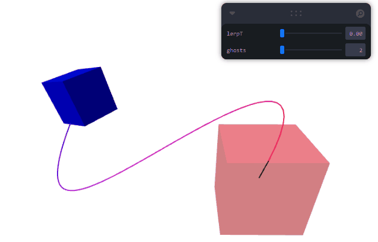

# Taller - Interpolación de Movimiento: Suavizando Animaciones en Tiempo Real

Exploración de técnicas de interpolación y animación de trayectorias usando Three.js y React Three Fiber. Se implementa una escena donde objetos se mueven suavemente entre posiciones clave, permitiendo experimentar con diferentes métodos de interpolación y animación.

## Three.js

La escena permite:
- Definir los keyFrames translucidos visibles.
- Interpolar Posicion (linealmente) a travez de un curva de bezier cubica, color(linealmente) y orientación (lineal esfericamente).
- Escoger el factor de Interpolacion mediante controles interactivo.

### Estructura de la escena (resumido)

```jsx
function AnimatedObject() {
  // ...
  useFrame((state, delta) => {
    const t = state.clock.getElapsedTime();
    if(bezier) meshRef.current.position.copy(bezierCurve.getPoint(lerpT));
    if(stateA && stateB){
      if(stateA.color && stateB.color) meshRef.current.material.color = new THREE.Color().lerpColors(stateA.color, stateB.color, lerpT);
      if(stateA.rot && stateB.rot) meshRef.current.quaternion.copy(new THREE.Quaternion().slerpQuaternions(stateA.rot, stateB.rot, lerpT));
    }
  })
  // ...
}

export default function App() {
  // ...
  <Canvas>  
    {/* ... */}
    <Scene
      stateA={{
        color: new THREE.Color("#0000FF"),
        rot: new THREE.Quaternion().setFromAxisAngle(new THREE.Vector3(1,1,1).normalize(), 3*Math.PI/4)
      }}
      stateB={{
        color: new THREE.Color("#FF0000"),
        rot: new THREE.Quaternion().setFromAxisAngle(new THREE.Vector3(0,1,0).normalize(), Math.PI/4)
      }}
      bezier={[new THREE.Vector3(-2.5,0,0),new THREE.Vector3(-2.5,-5,4),new THREE.Vector3(2.5,3,-3),new THREE.Vector3(2.5,0,0)]}
      lerpT={lerpT} ghosts={ghosts}
    />
    <OrbitControls makeDefault/>
  </Canvas>
  // ...
}
```
### Demostración



### Ejecución

El código principal está en [`App.jsx`](./threejs/src/App.jsx). Para ejecutar la escena:

```sh
cd threejs
npm install
npm run dev
```

Luego abre el navegador en la dirección indicada por Vite para interactuar con la animación y experimentar con diferentes métodos de interpolación.

---

Esta práctica es útil para comprender cómo se interpolan movimientos en gráficos 3D, cómo se construyen animaciones suaves y cómo se pueden controlar y visualizar trayectorias en tiempo real.