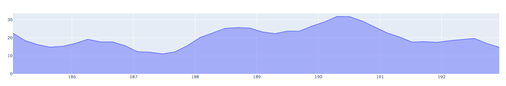

# Taller - Visualización de Datos en Tiempo Real: Gráficas en Movimiento

Exploración de técnicas para graficar datos en tiempo real usando Python y Plotly en un entorno de Jupyter Notebook.

## Descripción

Se implementa una simulación de adquisición y visualización de datos de temperatura en tiempo real:
- Se genera una señal sintética de temperatura con ruido y variaciones periódicas.
- Los datos se grafican dinámicamente usando `plotly.graph_objects.FigureWidget`, actualizando la curva en vivo.
- El gráfico muestra una ventana deslizante de los últimos 40 valores para simular un monitoreo continuo.

### Estructura del código principal

```python
import numpy as np
import plotly.graph_objects as go
import time

def fakeTemp(t: float):
    return 4*np.sin(np.pi*t) + 7*np.sin(t) + np.random.random()*2 + 20

dataY = np.array([])
dataX = np.array([])

fig = go.FigureWidget()
fig.add_scatter(y=dataY, fill='tozeroy')
display(fig)

initT = time.time()
elapsed = 0
maxL = 40

for i in range(1000):
    if(dataY.shape[0] < maxL):
        dataY = np.append(dataY, fakeTemp(elapsed))
        dataX = np.append(dataX, elapsed)
    else:
        dataY = np.concatenate((dataY[1:], [fakeTemp(elapsed)]))
        dataX = np.concatenate((dataX[1:], [elapsed]))

    fig.data[0].y = dataY
    fig.data[0].x = dataX
    time.sleep(0.2)
    elapsed = time.time() - initT
```
### Demostración



### Ejecución

Abre el notebook [`visualizacion_datos.ipynb`](./python/visualizacion_datos.ipynb) y ejecuta las celdas para ver la gráfica en tiempo real.

---

Esta práctica es útil para aprender cómo visualizar datos en vivo, simular sensores y construir dashboards interactivos en Python.