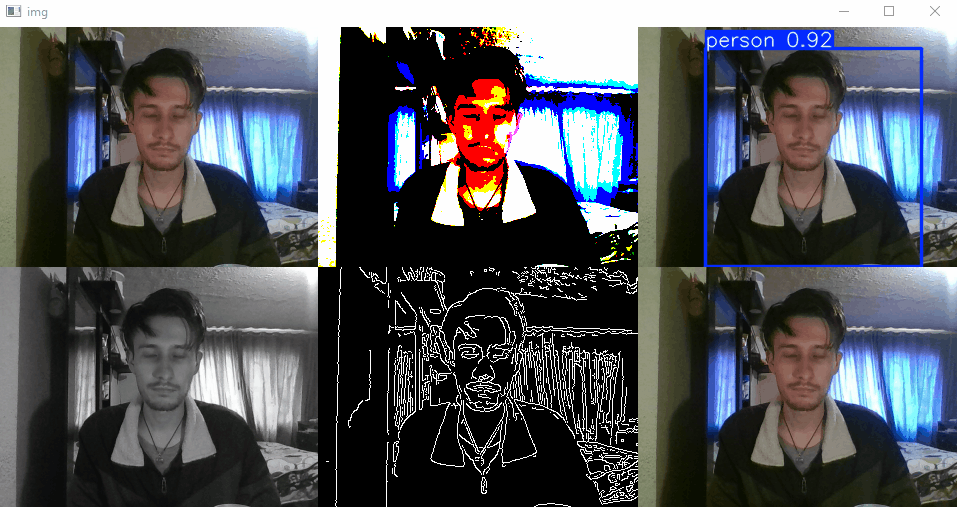

# Taller - Cámara en Vivo: Captura y Procesamiento de Video en Tiempo Real con YOLO

Exploración de técnicas de visión por computador en tiempo real usando YOLO (You Only Look Once) y OpenCV en Python. Se implementa un sistema que detecta objetos en vivo desde la cámara web y muestra resultados junto a transformaciones clásicas de imagen.

## Descripción

El notebook implementa:
- Captura de video en vivo desde la cámara web usando OpenCV.
- Detección de objetos en tiempo real con un modelo YOLO preentrenado (usando la librería Ultralytics).
- Visualización simultánea de:
  - Imagen original
  - Imagen con detecciones YOLO
  - Imagen en escala de grises
  - Imagen umbralizada
  - Imagen de bordes (Canny)
- Controles de teclado:
  - `p`: Pausa/reanuda la detección.
  - `s`: Guarda la imagen actual.
  - `ESC`: Sale del programa.

### Estructura del código principal

```python
model = YOLO("yolo11n.pt")

cap = cv2.VideoCapture(0)
paused = False
fullImg = None

while(True):
    # ...
    bCap, img = cap.read()
    # Procesamiento y detección
    results = model(img, stream=True, verbose=False)
    # Visualización de resultados y transformaciones
    # ...
    if key == 27:
        break
cap.release()
cv2.destroyAllWindows()
```
### Demostración



### Ejecución

Abre el notebook [`viovo_yolo_opencv.ipynb`](./python/viovo_yolo_opencv.ipynb) y ejecuta las celdas. Asegúrate de tener una cámara web conectada y el archivo `yolo11n.pt` en el directorio adecuado.

---

Esta práctica es útil para aprender cómo integrar modelos de detección de objetos en tiempo real con procesamiento clásico de imágenes, y cómo visualizar múltiples transformaciones simultáneamente en Python.