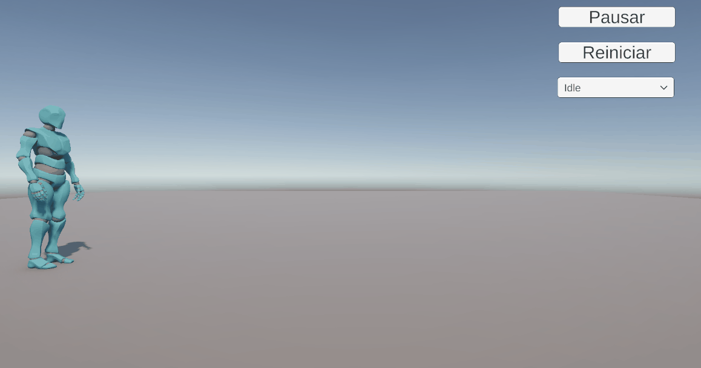
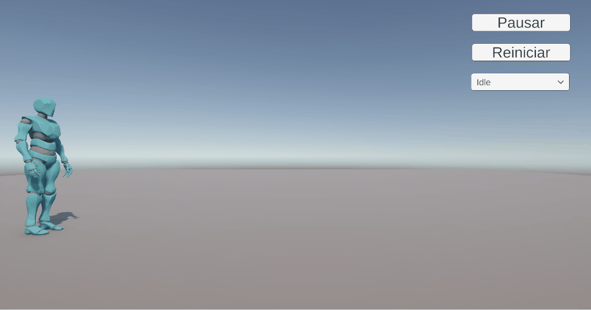

# 2025-06-24_Taller_animaciones_esqueleto_fbx_gltf

## Unity – Animaciones esqueléticas con Mixamo y control por UI

Este proyecto implementa un sistema de control de animaciones esqueléticas en Unity utilizando un personaje humanoide descargado desde Mixamo en formato `.FBX`. Se integraron varias animaciones como **Idle**, **Walk**, **Run** y **Dance**, y se controlan mediante una interfaz de usuario que permite cambiar de animación, pausar y reiniciar la posición y estado del personaje. Se usó un `Animator Controller` con transiciones básicas y un sistema de eventos con botones y dropdowns para la interacción del usuario.

**¿Qué es el sistema de animación por esqueleto?**  
Es un sistema que utiliza un *rig* (esqueleto virtual con huesos) y animaciones predefinidas (*clips*) que afectan a ese esqueleto. Esto permite que un solo modelo 3D pueda reproducir múltiples animaciones reutilizables como caminar, correr o saludar. En Unity, este sistema se gestiona con el componente `Animator`, que ejecuta animaciones importadas y permite controlar transiciones y estados de forma lógica.

**Componentes utilizados en este taller:**

- **Modelo 3D con rig humanoide** exportado desde Mixamo.
- **Clips de animación** (`Idle`, `Walk`, `Run`, `Dance`) en archivos `.FBX` sin esqueleto duplicado.
- **Animator Controller** con transiciones entre clips basadas en parámetros.
- **Scripts en C#** que responden a entrada de usuario (`Dropdown`, `Button`) y modifican el comportamiento del `Animator`.

## Pasos realizados

1. **Descarga de modelo y animaciones desde Mixamo**  
   Se seleccionó un personaje humanoide en Mixamo y se exportó en `.FBX for Unity` con el esqueleto incluido. Luego se descargaron clips de animación por separado (`Idle`, `Walk`, `Run`, `Dance`).

2. **Importación en Unity**  
   Los archivos `.FBX` se arrastraron a la carpeta `Assets`. A cada archivo se le configuró el rig como `Humanoid` en la pestaña `Rig`, y se marcaron ajustes como `Loop Time` en clips de tipo idle o run.

3. **Creación del Animator Controller**  
   Se creó un controlador `PlayerAnimator.controller` donde se agregaron los clips como estados. Se definieron parámetros (`int`, `bool`, `trigger`) para usarlos en transiciones y para generar cambios en las animaciones por medio del teclado. 

4. **Configuración del GameObject del personaje**  
   Se instanció el modelo desde el `.FBX` en la jerarquía, se le asignó el `Animator Controller`, y se ajustó posición y escala para correcta visualización en escena.

5. **Implementación de UI**  
   Se usó `Canvas` con:
   - Un `TMP_Dropdown` con las opciones de animación.
   - Un `Botón Pausar/Reanudar` para activar o detener la animación (modificando `animator.speed`).
   - Un `Botón Reiniciar` para devolver al personaje a su posición y rotación original y reestablecer la animación `"Idle"`.

6. **Programación del controlador de animaciones**  
   Se creó el script `UIAnimationControl.cs`, encargado de manejar las interacciones de UI y actualizar el `Animator` del personaje según las acciones del usuario. También gestiona el estado de pausa y reinicio.

7. **Distanciar ambos modos**  
   Despues de varios problemas se decidió distanciar el modo por teclado y por UI para que no intervengan entres si, para usar el teclado hay que quitar el `Has Exit Time` para cada transición dentro del `Animator Controller` y para usar el UI se debe poner el `Has Exit Time` tambien en cada transición.

## Resultados

Script principal para control de animación por UI (UIAnimationControl.cs):

---

```csharp
using UnityEngine;
using UnityEngine.UI;
using TMPro;

public class UIAnimationControl : MonoBehaviour
{
    public Animator animator;
    public TMP_Dropdown animDropdown;
    public Transform character;  // Referencia al GameObject del personaje

    private Vector3 originalPosition;
    private Quaternion originalRotation;
    private bool isPaused = false;

    void Start()
    {
        animDropdown.onValueChanged.AddListener(ChangeAnimation);

        // Guardar la posición y rotación inicial
        if (character != null)
        {
            originalPosition = character.position;
            originalRotation = character.rotation;
        }
    }

    public void TogglePause()
    {
        isPaused = !isPaused;
        animator.speed = isPaused ? 0 : 1;
    }

    public void ResetCharacter()
    {
        if (character != null)
        {
            character.position = originalPosition;
            character.rotation = originalRotation;
        }

        isPaused = false;
        animator.speed = 1;
        animator.Play("Idle");
        animDropdown.value = 0; // Actualiza visualmente el dropdown
    }

    public void ChangeAnimation(int index)
    {
        isPaused = false;
        animator.speed = 1;

        switch (index)
        {
            case 0: animator.Play("Idle"); break;
            case 1: animator.Play("Walk"); break;
            case 2: animator.Play("Run"); break;
            case 3: animator.Play("Dance"); break;
        }
    }
}
```

---

Script secundario para control por medio de teclas (UIAnimationControl.cs):

---


```csharp
using UnityEngine;

public class PlayerAnimationController : MonoBehaviour
{
    public Animator animator;

    void Update()
    {
        float speed = 0f;

        // Detectar si W está presionado continuamente
        if (Input.GetKey(KeyCode.W))
        {
            speed = 0.5f; // caminar por defecto
        }

        // Si además estás presionando Shift mientras caminas
        if (Input.GetKey(KeyCode.W) && Input.GetKey(KeyCode.LeftShift))
        {
            speed = 2f; // correr
        }

        animator.SetFloat("Speed", speed); // siempre actualizar el parámetro

        // Animación de baile (presionar espacio)
        if (Input.GetKeyDown(KeyCode.Space))
        {
            animator.SetBool("IsDancing", true);
        }

        if (Input.GetKeyUp(KeyCode.Space))
        {
            animator.SetBool("IsDancing", false);
        }
    }
}
```

---

Comportamiento por teclado:



---

---

Comportamiento por UI:



---

---

## Reflexión

Aprendí a importar y reutilizar animaciones sobre un mismo esqueleto, a manejar la transición entre clips usando Animator Controller, y a usar Play() para disparar clips específicos. También comprendí cómo pausar y reiniciar animaciones correctamente, restaurando la posición original del modelo. Tambien que se debe distanciar el control por UI y por teclado porque pueden interferir entre si.