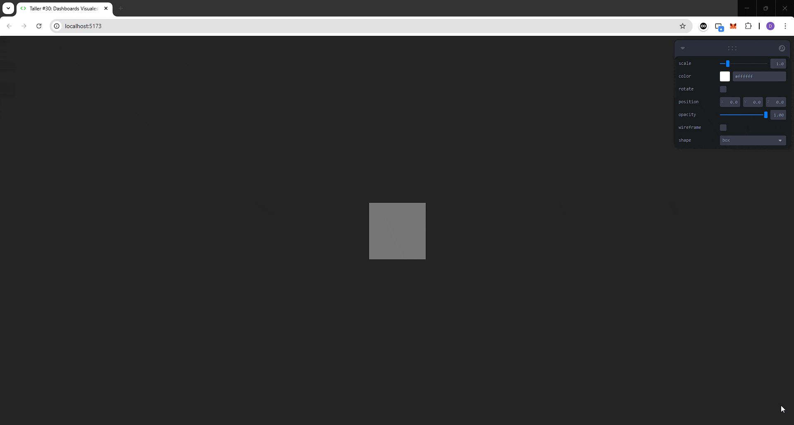

# 🧪 Taller - Dashboards Visuales 3D: Sliders y Botones para Controlar Escenas

## 📅 Fecha
`2025-06-25`

---

## 🎯 Objetivo del Taller

Crear interfaces gráficas 3D interactivas que permitan al usuario controlar elementos de una escena, como transformaciones, colores o luces. El propósito es construir paneles funcionales y visuales que conecten entradas de usuario (sliders, botones) con la modificación en tiempo real de objetos 3D.

---

## 🧠 Conceptos Aprendidos

- [x] Transformaciones geométricas (escala, rotación, traslación)
- [x] Manejo de eventos y estados en aplicaciones 3D
- [x] Creación de interfaces interactivas
- [x] Uso de controles en tiempo real (sliders, botones)

---

## 🔧 Herramientas y Entornos

- Three.js (`React Three Fiber`, `leva`)

---

## 📁 Estructura del Proyecto

```
2025-06-25_taller_dashboards_visuales_3d_sliders_botones/
├── threejs/               # Three.js
├── resultado/            # capturas, métricas, gifs
├── README.md
```

---

## 🧪 Implementación


### 🔹 Etapas realizadas
1. Configuración del entorno de Three.js con React Three Fiber.
2. Creación de un objeto 3D básico (caja, esfera o cilindro).
3. Implementación de controles interactivos con `leva` para modificar propiedades del objeto.
4. Animación del objeto según las entradas del usuario.
5. Visualización de resultados en tiempo real.
6. Generación de GIFs para documentar el funcionamiento.
7. Documentación del proceso y resultado.


### 🔹 Código relevante

#### Three.js

```javascript
    // Configuración de controles con Leva
    const {scale, color, rotate, position, opacity, wireframe, shape } = useControls({
        scale: { value: 1, min: 0.5, max: 4, step: 0.1 },
        color: '#ffffff',
        rotate: false,
        position: { value: [0, 0, 0], step: 0.1 },
        opacity: { value: 1, min: 0, max: 1, step: 0.01 },
        wireframe: false,
        shape: { options: ['box', 'sphere', 'cylinder'] }
    })
```
```javascript
    // Estado para la rotación del objeto
    const [rotationY, setRotationY] = useState(0)

    // Animación de rotación del objeto
    useFrame(() => {
        if (rotate) { setRotationY((prev) => prev + 0.01) }
    })

    // Selección de la geometría según la forma elegida
    let geometry = null
    if (shape === 'box') {
        geometry = <boxGeometry args={[scale, scale, scale]} />
    } else if (shape === 'sphere') {
        geometry = <sphereGeometry args={[scale / 2, 32, 32]} />
    } else if (shape === 'cylinder') {
        geometry = <cylinderGeometry args={[scale / 2, scale / 2, scale, 32]} />
    }
```
```html
<mesh rotation={[0, rotationY, 0]} position={position}>
    {geometry}
    <meshStandardMaterial color={color} opacity={opacity} transparent={true} wireframe={wireframe}/>
</mesh>
```


---
## 📊 Resultado Visual


### Three.js


---

## 🧩 Prompts Usados

### Three.js
```text
En una aplicación con React Three Fiber, crea una escena 3D que incluya al menos un objeto básico (como un Box, Sphere o Torus). Utiliza leva o dat.GUI para construir una interfaz interactiva con controles en tiempo real: un deslizador para ajustar la escala del objeto (scale), un selector de color para modificar su material (material.color), y un botón que permita alternar entre diferentes materiales o active una rotación automática. Asegura que cada control esté correctamente enlazado a la propiedad correspondiente del objeto mediante useControls() (en leva) o GUI.add(...) (en dat.GUI), logrando una actualización inmediata y reactiva desde la interfaz.
```


---

## 💬 Reflexión Final

- **¿Qué aprendiste o reforzaste con este taller?**
Aprendí a crear interfaces gráficas interactivas en 3D utilizando Three.js y React Three Fiber, integrando controles como sliders y botones para manipular objetos en tiempo real.

- **¿Qué parte fue más compleja o interesante?**
La parte más interesante fue implementar la animación en tiempo real de los objetos 3D a través de los controles, lo que permitió una experiencia interactiva fluida.

- **¿Qué mejorarías o qué aplicarías en futuros proyectos?**
Exploraría más opciones de personalización en los controles y añadiría más interactividad, como eventos de clic o arrastre para manipular los objetos directamente.

---


## ✅ Checklist de Entrega

- [x] Carpeta `2025-06-25_taller_dashboards_visuales_3d_sliders_botones`
- [x] Código limpio y funcional
- [x] GIF incluido con nombre descriptivo
- [x] README completo y claro
- [x] Commits descriptivos en inglés

---