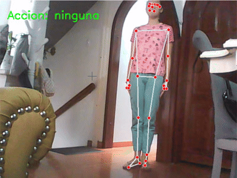

# 🧪 Taller - Reconocimiento de Acciones Simples con Detección de Postura

## 📅 Fecha
`2025-06-25`

---

## 🎯 Objetivo del Taller

Implementar el reconocimiento de acciones simples (como sentarse, levantar brazos o caminar frente a cámara) usando MediaPipe Pose para detectar la postura corporal. El objetivo es utilizar puntos clave del cuerpo (landmarks) para interpretar la acción y responder visual o sonoramente.

---

## 🧠 Conceptos Aprendidos

- [x] Uso de MediaPipe Pose para detección de posturas.
- [x] Captura de video en tiempo real con OpenCV.
- [x] Procesamiento de imágenes y detección de puntos clave del cuerpo.
- [x] Implementación de lógica condicional para reconocer acciones.
- [x] Visualización de resultados en tiempo real.

---

## 🔧 Herramientas y Entornos

- Python (`opencv-python`, `mediapipe`)


---

## 📁 Estructura del Proyecto

```
2025-06-25_taller_reconocimiento_postura_mediapipe/
├── python/                # Python
├── resultados/            # capturas, métricas, gifs
├── README.md
```

---

## 🧪 Implementación


### 🔹 Etapas realizadas
1. Instalación de dependencias: `opencv-python`, `mediapipe`.
2. Configuración de captura de video con OpenCV.
3. Inicialización de MediaPipe Pose para detectar puntos clave del cuerpo.
4. Procesamiento de cada frame del video para detectar acciones.
5. Condiciones lógicas para identificar acciones como 'sentarse', 'levantar brazos' o 'caminar'.
6. Visualización de resultados en tiempo real y salida de texto en consola.

### 🔹 Código relevante


#### Python

```python
def obtener_poses():
    left_shoulder = get_coords(mp_pose.PoseLandmark.LEFT_SHOULDER.value)
    right_shoulder = get_coords(mp_pose.PoseLandmark.RIGHT_SHOULDER.value)
    left_wrist = get_coords(mp_pose.PoseLandmark.LEFT_WRIST.value)
    right_wrist = get_coords(mp_pose.PoseLandmark.RIGHT_WRIST.value)
    left_hip = get_coords(mp_pose.PoseLandmark.LEFT_HIP.value)
    right_hip = get_coords(mp_pose.PoseLandmark.RIGHT_HIP.value)
    left_knee = get_coords(mp_pose.PoseLandmark.LEFT_KNEE.value)
    right_knee = get_coords(mp_pose.PoseLandmark.RIGHT_KNEE.value)
    left_ankle = get_coords(mp_pose.PoseLandmark.LEFT_ANKLE.value)
    right_ankle = get_coords(mp_pose.PoseLandmark.RIGHT_ANKLE.value)
```

```python
promedio_hombros_y = (left_shoulder[1] + right_shoulder[1]) / 2
promedio_munecas_y = (left_wrist[1] + right_wrist[1]) / 2
if promedio_munecas_y < promedio_hombros_y:
    action = "levantar brazos"

promedio_caderas_y = (left_hip[1] + right_hip[1]) / 2
promedio_rodillas_y = (left_knee[1] + right_knee[1]) / 2
if promedio_caderas_y > promedio_rodillas_y + 30:  # Umbral ajustable
    action = "sentarse"

posicion_actual_tobillos = (left_ankle[0], right_ankle[0])
global posicion_previa_tobillos
if posicion_previa_tobillos is not None:
    movimiento = abs(posicion_actual_tobillos[0] - posicion_previa_tobillos[0]) + \
                abs(posicion_actual_tobillos[1] - posicion_previa_tobillos[1])
    if movimiento > umbral_movimiento:
        action = "caminar"
posicion_previa_tobillos = posicion_actual_tobillos
```


---
## 📊 Resultados Visuales

### Python


---

## 🧩 Prompts Usados


### Python
```text
En Python, usando Jupyter Notebook o entorno local, implementa un sistema de reconocimiento de acciones simples como 'sentarse', 'levantar brazos' o 'caminar frente a la cámara' utilizando MediaPipe Pose. Captura video en tiempo real con `cv2.VideoCapture(0)` e inicializa MediaPipe Pose para detectar los puntos clave del cuerpo (landmarks), como hombros, caderas, rodillas y muñecas. Aplica condiciones lógicas basadas en las coordenadas de estos puntos para identificar cada acción. Muestra en consola el nombre de la acción reconocida en cada frame procesado.
```


---

## 💬 Reflexión Final

- ¿Qué aprendiste o reforzaste con este taller?

Aprendí a utilizar MediaPipe Pose para detectar posturas corporales y reconocer acciones simples en tiempo real, lo cual es útil para aplicaciones de interacción humano-computadora.

- ¿Qué parte fue más compleja o interesante?

La parte más interesante fue la implementación de las condiciones lógicas para reconocer acciones específicas basadas en los puntos clave del cuerpo. Esto requiere una buena comprensión de la geometría del cuerpo humano y cómo se relacionan los puntos entre sí.

- ¿Qué mejorarías o qué aplicarías en futuros proyectos?

Mejoraría la precisión del reconocimiento de acciones añadiendo más condiciones y posiblemente integrando aprendizaje automático para mejorar la detección de posturas en diferentes contextos.

---

## ✅ Checklist de Entrega

- [x] Carpeta `2025-06-25_taller_reconocimiento_postura_mediapipe`
- [x] Código limpio y funcional
- [x] GIF incluido con nombre descriptivo
- [x] Visualizaciones o métricas exportadas
- [x] README completo y claro
- [x] Commits descriptivos en inglés

---