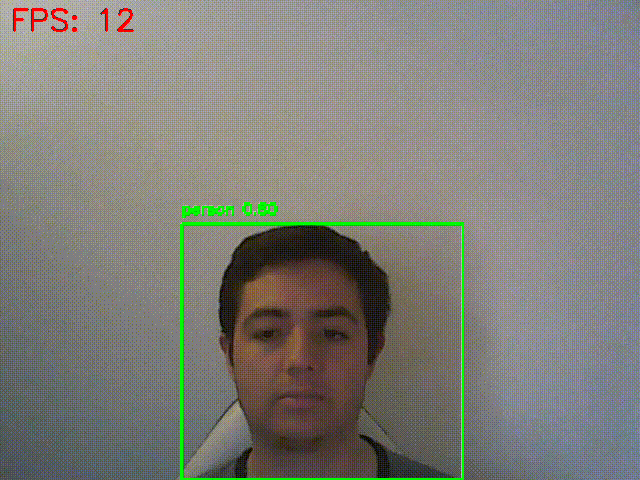

# 🧪 Taller - Detección de Objetos en Tiempo Real con YOLO y Webcam

## 📅 Fecha
`2025-06-25`

---

## 🎯 Objetivo del Taller

Implementar detección de objetos en tiempo real utilizando un modelo YOLOv5 o YOLOv8 preentrenado, capturando la señal de la webcam del computador. Se busca explorar la eficiencia y precisión del modelo, así como medir el desempeño del sistema en vivo (FPS).

---

## 🧠 Conceptos Aprendidos

- [x] Detección de objetos en tiempo real
- [x] Uso de modelos preentrenados (YOLOv12)
- [x] Procesamiento de video en vivo con OpenCV
- [x] Visualización de resultados en tiempo real
- [x] Medición de rendimiento (FPS, tiempo de inferencia)
- [x] Filtrado de clases específicas en detección

---

## 🔧 Herramientas y Entornos

- Python (`opencv-python`, `ultralytics`, `torch`)

---

## 📁 Estructura del Proyecto

```
2025-06-25_taller_yolo_deteccion_webcam_tiempo_real/
├── python/                # Python
├── resultado/             # captura, métrica, gif
├── README.md
```

---

## 🧪 Implementación


### 🔹 Etapas realizadas
1. Configuración del entorno de Python con las librerías necesarias.
2. Carga del modelo YOLOv12 preentrenado.
3. Captura de video en vivo desde la webcam.
4. Procesamiento de cada frame para detección de objetos.
5. Dibujo de cajas delimitadoras y etiquetas en los frames.
6. Filtrado de detecciones por clases específicas.
7. Cálculo y visualización de FPS en tiempo real.
8. Manejo de eventos para salir del programa.
9. Generación de un GIF del proceso.
10. Documentación del código y resultado.


### 🔹 Código relevante


#### Python

```python
# Cargar el modelo YOLOv12 preentrenado
model = YOLO('yolo12n.pt')

# Clases a filtrar y mostrar
CLASSES_TO_SHOW = ['person', 'cell phone', 'spoon']
````


```python
def process_frame(frame, result):
    """Procesa un frame y dibuja las detecciones."""
    boxes = result.boxes  # Obtener las cajas detectadas

    for box in boxes:
        x1, y1, x2, y2 = map(int, box.xyxy[0])          # Obtener coordenadas de la caja delimitadora
        conf = box.conf[0]                              # Confianza
        cls_id = int(box.cls[0])                        # ID de clase
        label = class_names[cls_id]                     # Nombre de la clase

        # Filtrar por clases específicas
        if class_names[cls_id] not in CLASSES_TO_SHOW:
            continue

        # Dibujar la caja y el texto en el frame
        text = f"{label} {conf:.2f}"
        draw_boxes(frame, text, x1, y1, x2, y2)
```


---
## 📊 Resultados Visuales

### Python


---

## 🧩 Prompts Usados

### Python
```text
En Python, usando ejecución local y una webcam, implementa un sistema de detección de objetos en tiempo real utilizando opencv-python, ultralytics y torch. Captura los frames de video en vivo y, en cada uno, mide el tiempo de inicio para calcular el tiempo por inferencia y los FPS. Utiliza model.predict(source=frame, stream=True) para detectar objetos, dibuja las cajas delimitadoras, etiquetas y nivel de confianza en el frame, y muestra únicamente ciertas clases específicas. Además, muestra gráficamente los FPS en una esquina del video y permite salir del programa presionando la tecla 'q'. Finalmente, muestra el resultado en una ventana con cv2.imshow().
```

---

## 💬 Reflexión Final

- ¿Qué aprendiste o reforzaste con este taller?
Aprendí a implementar un sistema de detección de objetos en tiempo real utilizando modelos preentrenados de YOLO, así como a manejar la captura y procesamiento de video en vivo con OpenCV.

- ¿Qué parte fue más compleja o interesante?
La parte más interesante fue la integración del modelo YOLO con la captura de video en tiempo real, ya que el modelo ya estaba optimizado para realizar inferencias rápidas y precisas.

- ¿Qué mejorarías o qué aplicarías en futuros proyectos?
Consideraría ampliar la lista de clases a detectar y optimizar el rendimiento del sistema para manejar múltiples objetos en pantalla sin perder FPS.

---


## ✅ Checklist de Entrega

- [x] Carpeta `2025-06-25_taller_yolo_deteccion_webcam_tiempo_real`
- [x] Código limpio y funcional
- [x] GIF incluido con nombre descriptivo
- [x] Visualizaciones o métricas exportadas
- [x] README completo y claro
- [x] Commits descriptivos en inglés

---