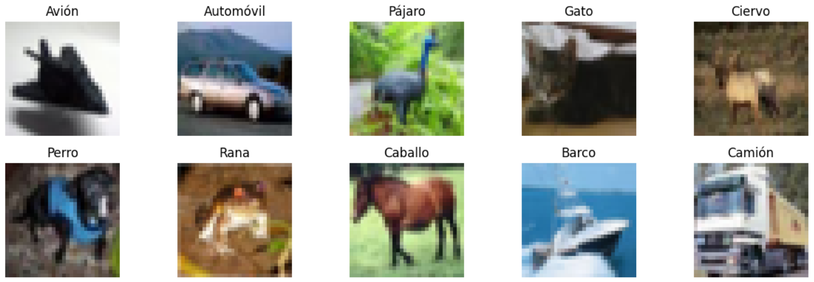
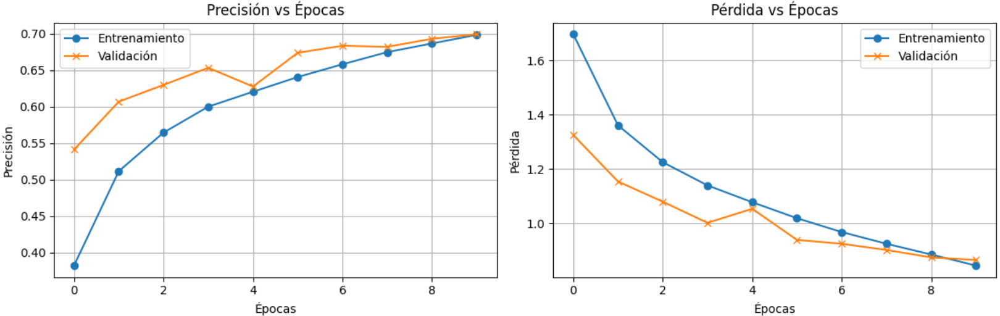
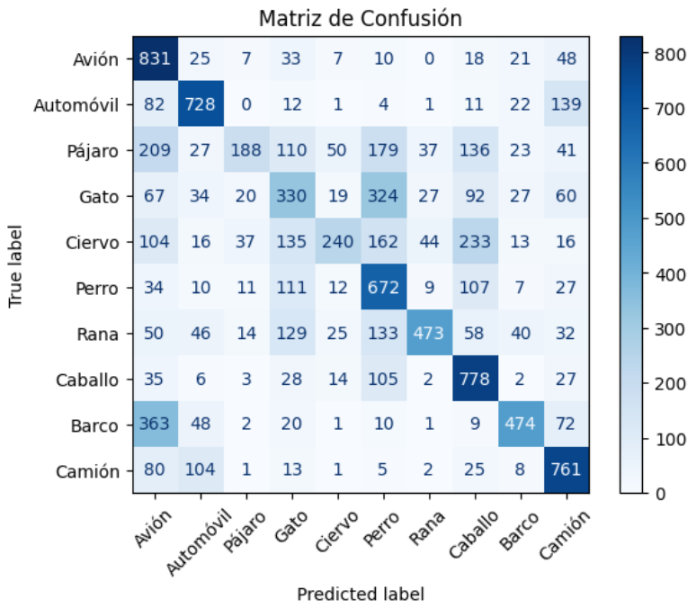
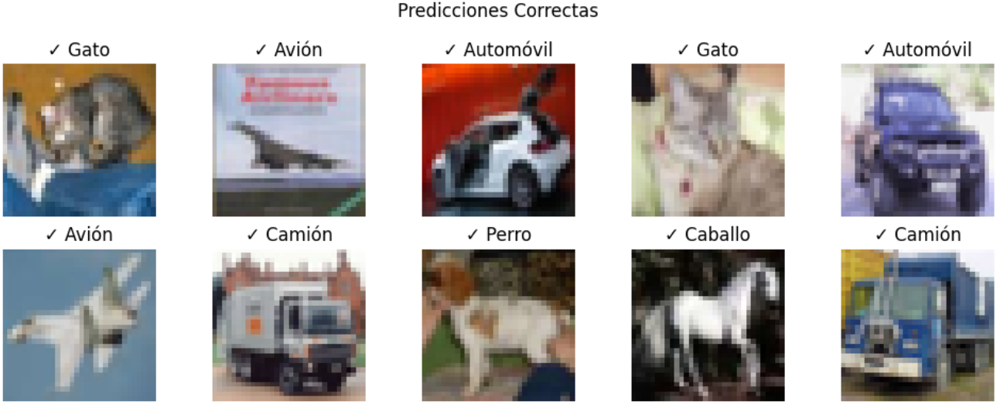
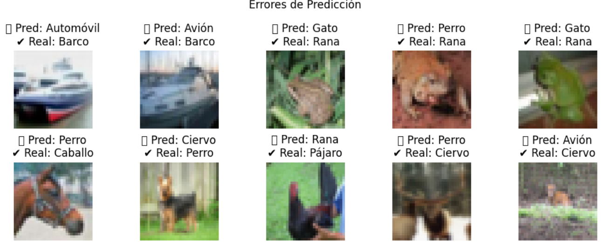

# 2025-07-02_Taller_cnn_basico_deep_learning_keras_pytorch

## Python

En este taller se trabajó con un modelo de red neuronal convolucional (CNN) desde cero usando el dataset **CIFAR-10**, el cual contiene 60.000 imágenes RGB de 32x32 píxeles de 10 clases diferentes.  

Se usó el framework **Keras (TensorFlow)** para el desarrollo, entrenamiento y evaluación del modelo, además de `matplotlib` y `sklearn` para visualizar métricas y analizar resultados.

1. **Cargar y preprocesar el dataset CIFAR-10**  
   - Se cargaron las imágenes y etiquetas desde `tensorflow.keras.datasets.cifar10`.  
   - Se normalizaron las imágenes dividiendo los valores de píxeles entre 0 y 1.  
   - Se visualizó una imagen representativa por cada clase del conjunto.  

2. **Dividir datos en entrenamiento, validación y prueba**  
   - Se utilizó `train_test_split` con `stratify` para mantener la proporción de clases.  
   - Se dividió el conjunto original de entrenamiento en entrenamiento (80%) y validación (20%).  
   - El conjunto `x_test` se reservó sin modificaciones para la evaluación final.

3. **Construcción de la CNN**  
   - Se utilizó un modelo `Sequential` con la arquitectura:
     - `Conv2D → ReLU → MaxPooling`
     - `Conv2D → ReLU → MaxPooling`
     - `Flatten → Dense(128) → Dropout(0.5) → Dense(10, softmax)`
   - Se explicaron los parámetros clave como número de filtros, tamaño del kernel, padding, activaciones y capas densas.

4. **Entrenamiento del modelo**  
   - Se compiló el modelo usando la pérdida `sparse_categorical_crossentropy`, el optimizador `Adam` y la métrica `accuracy`.  
   - Se entrenó por 10 épocas con `batch_size=64`, usando el conjunto de validación para monitorear el desempeño.  
   - Se guardó el historial del entrenamiento para graficar posteriormente las métricas.

5. **Visualización de métricas de entrenamiento**  
   - Se graficaron las curvas de `accuracy` y `loss` para entrenamiento y validación a lo largo de las épocas.  
   - Se analizaron posibles señales de overfitting observando las diferencias entre las curvas.

6. **Evaluación y análisis del modelo**  
   - Se evaluó el modelo sobre el conjunto `x_test`, obteniendo una precisión de aproximadamente **69%**.  
   - Se generó una matriz de confusión usando `sklearn` para visualizar errores por clase.  
   - Se visualizaron imágenes correctamente clasificadas y ejemplos de predicciones incorrectas, incluyendo la clase predicha y la clase real.

---

## Resultados

Cargar los datos

```python
pip install tensorflow matplotlib numpy scikit-learn

import tensorflow as tf
from tensorflow.keras.datasets import cifar10
from sklearn.model_selection import train_test_split
import matplotlib.pyplot as plt
import numpy as np

# Cargar dataset
(x_train, y_train), (x_test, y_test) = cifar10.load_data()

# Normalizar
x_train = x_train / 255.0

# Nombres de clases
clases = ['Avión', 'Automóvil', 'Pájaro', 'Gato', 'Ciervo',
          'Perro', 'Rana', 'Caballo', 'Barco', 'Camión']

# Buscar la primera imagen de cada clase
imagenes_por_clase = []
for clase_id in range(10):
    idx = np.where(y_train == clase_id)[0][0]  # primer índice donde aparece la clase
    imagenes_por_clase.append((x_train[idx], clases[clase_id]))

# Visualizar una imagen por clase
plt.figure(figsize=(12, 4))
for i, (img, nombre) in enumerate(imagenes_por_clase):
    plt.subplot(2, 5, i + 1)
    plt.imshow(img)
    plt.title(nombre)
    plt.axis('off')
plt.tight_layout()
plt.show()

# Posteriormente separar los datos de train en validation y train, el dataset ya viene separado en train y test

# Dividir x_train original en entrenamiento y validación
x_train_sub, x_val, y_train_sub, y_val = train_test_split(
    x_train, y_train, test_size=0.2, random_state=42, stratify=y_train)

print("Nuevos tamaños:")
print("Train:", x_train_sub.shape)
print("Val:", x_val.shape)
print("Test (sin tocar):", x_test.shape)

# Verificar que haya mismo numero en cada clase
def contar_clases(y, nombre):
    clases, counts = np.unique(y, return_counts=True)
    print(f"\nDistribución en {nombre}:")
    for c, count in zip(clases, counts):
        print(f"Clase {c}: {count}")

contar_clases(y_train_sub, "entrenamiento")
contar_clases(y_val, "validación")
```
---



---

Creación del modelo

```python
from tensorflow.keras.models import Sequential
from tensorflow.keras.layers import Conv2D, MaxPooling2D, Activation, Flatten, Dense, Dropout

# Definir modelo CNN siguiendo la arquitectura
model = Sequential([
    # Primera etapa: Conv → ReLU → MaxPool
    Conv2D(filters=32, kernel_size=(3,3), padding='same', input_shape=(32,32,3)),
    Activation('relu'),
    MaxPooling2D(pool_size=(2,2)),

    # Segunda etapa: Conv → ReLU → MaxPool
    Conv2D(filters=64, kernel_size=(3,3), padding='same'),
    Activation('relu'),
    MaxPooling2D(pool_size=(2,2)),

    # Aplanar y capa densa
    Flatten(),
    Dense(128),
    Activation('relu'),
    Dropout(0.5),

    # Capa de salida (softmax para multiclase)
    Dense(10),
    Activation('softmax')
])
```
---

Explicación de parámetros clave:

Conv2D(...):

Extrae características visuales (bordes, texturas, formas) de la imagen.

filters=32 o 64: Número de filtros o kernels. Cuantos más, más patrones puede aprender.

kernel_size=(3,3): Tamaño del filtro (3x3 es estándar).

activation='relu': Aplica la función ReLU (Rectified Linear Unit), que introduce no linealidad (mejora el aprendizaje).

padding='same': Rellena los bordes para que la salida tenga el mismo tamaño que la entrada.

input_shape=(32,32,3): Tamaño de entrada (imagen CIFAR-10: 32x32 píxeles, 3 canales RGB). Solo se especifica en la primera capa

=========================================

MaxPooling2D(...)

Reduce tamaño espacial (ancho x alto), manteniendo características importantes.

pool_size=(2,2): Reduce a la mitad la dimensión con el valor máximo en cada bloque 2x2.

=========================================

Flatten()

Convierte la salida 2D de los filtros en un vector 1D, listo para la capa densa.

=========================================

Dense(...)

Capa neuronal clásica (completamente conectada).

Dense(128, activation='relu'): Capa con 128 neuronas y ReLU.

Dropout(0.5): Desactiva aleatoriamente el 50% de las neuronas durante el entrenamiento (reduce overfitting).

Dense(10, activation='softmax'): Capa de salida, una neurona por clase. softmax transforma los valores en probabilidades que suman 1.

========================================

Activaciones

ReLU: max(0, x). Acelera el entrenamiento, evita saturaciones.

Softmax: Distribuye la salida final en probabilidades para clasificación multiclase.

===========================================

---

Entrenamiento y curvas

```python
import matplotlib.pyplot as plt

model.compile(
    optimizer='adam',
    loss='sparse_categorical_crossentropy',
    metrics=['accuracy']
)

model.summary()

history = model.fit(
    x_train_sub, y_train_sub,
    epochs=10,
    batch_size=64,
    validation_data=(x_val, y_val),
    verbose=1
)

# Crear gráfico de precisión
plt.figure(figsize=(12, 4))

# Accuracy
plt.subplot(1, 2, 1)
plt.plot(history.history['accuracy'], label='Entrenamiento', marker='o')
plt.plot(history.history['val_accuracy'], label='Validación', marker='x')
plt.title('Precisión vs Épocas')
plt.xlabel('Épocas')
plt.ylabel('Precisión')
plt.legend()
plt.grid(True)

# Loss
plt.subplot(1, 2, 2)
plt.plot(history.history['loss'], label='Entrenamiento', marker='o')
plt.plot(history.history['val_loss'], label='Validación', marker='x')
plt.title('Pérdida vs Épocas')
plt.xlabel('Épocas')
plt.ylabel('Pérdida')
plt.legend()
plt.grid(True)

plt.tight_layout()
plt.show()
```
---



---

Resultados del modelo

```python
import numpy as np
from sklearn.metrics import confusion_matrix, ConfusionMatrixDisplay

# Evaluación final del modelo en el conjunto de prueba
test_loss, test_accuracy = model.evaluate(x_test, y_test, verbose=1)
print(f"Precisión final en test: {test_accuracy:.4f}")

# Predicciones
y_pred_probs = model.predict(x_test)
y_pred_classes = np.argmax(y_pred_probs, axis=1)
y_true = y_test.flatten()

# Etiquetas de clases CIFAR-10
clases = ['Avión', 'Automóvil', 'Pájaro', 'Gato', 'Ciervo',
          'Perro', 'Rana', 'Caballo', 'Barco', 'Camión']

# Matriz de confusión
cm = confusion_matrix(y_true, y_pred_classes)
disp = ConfusionMatrixDisplay(confusion_matrix=cm, display_labels=clases)
disp.plot(cmap='Blues', xticks_rotation=45)
plt.title("Matriz de Confusión")
plt.grid(False)
plt.show()
```
---



---

```python
import matplotlib.pyplot as plt

# Indices de predicciones correctas
aciertos = np.where(y_pred_classes == y_true)[0]

# Mostrar 10 aciertos
plt.figure(figsize=(10, 4))
for i, idx in enumerate(aciertos[:10]):
    plt.subplot(2, 5, i+1)
    plt.imshow(x_test[idx])
    plt.title(f"✓ {clases[y_true[idx]]}")
    plt.axis('off')
plt.suptitle("Predicciones Correctas")
plt.tight_layout()
plt.show()
```
---



---

```python
# Indices de errores
errores = np.where(y_pred_classes != y_true)[0]

# Mostrar 10 errores
plt.figure(figsize=(10, 4))
for i, idx in enumerate(errores[:10]):
    plt.subplot(2, 5, i+1)
    plt.imshow(x_test[idx])
    plt.title(f" Pred: {clases[y_pred_classes[idx]]}\n Real: {clases[y_true[idx]]}")
    plt.axis('off')
plt.suptitle("Errores de Predicción")
plt.tight_layout()
plt.show()
```
---



---

## Prompts usados

"Ayudame con el paso a paso para desarrollar (...)", Donde (...) se refiere al paso descrito en el taller. Por otro lado se usó tambien para realizar parte del readme dandole un ejemplo de un readme anterior.

## Reflexión

He aprendido que los **filtros y las capas convolucionales** son cruciales para entender y capturar patrones visuales de las imágenes, que usar un mayor número de filtros (por ejemplo, 64 en el lugar de 32) y añadir `Dropout` contribuye a mejorar la exactitud y reducir el sobreajuste, así como que funciones tales como `ReLU`, `MaxPooling` y la propia arquitectura de la red tienen un impacto directo en su capacidad de la red para generalizar.

Visualizar las curvas de entrenamiento me ayudó a encontrar una mejor combinación de hiperparámetros y a comprender como pequeñas decisiones que se toman en la arquitectura de las CNNs pueden llegar a tener un impacto directo en el modelo.