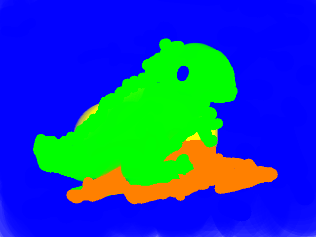
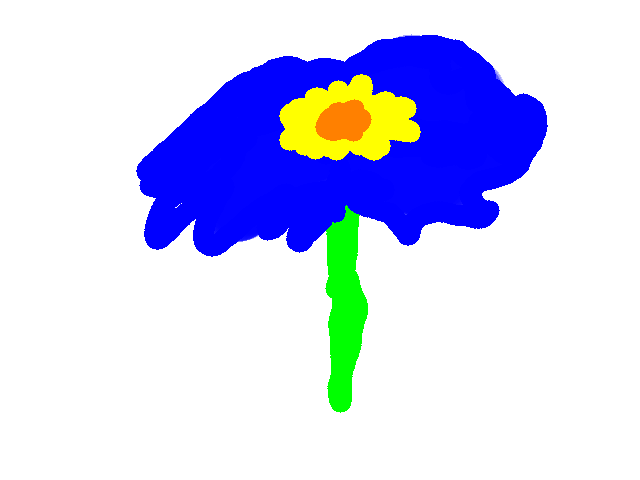
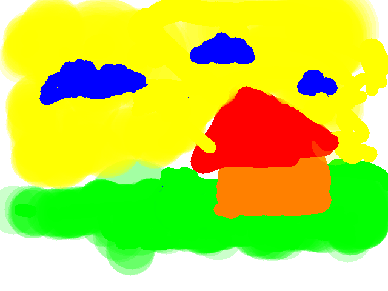

# 2025-07-02_Taller_pintura_interactiva_voz_gestos

## Python (entorno local con cámara y micrófono)

En este taller se desarrolló una aplicación interactiva en Python que utiliza visión por computadora y comandos de voz para simular un entorno de dibujo en tiempo real.

Se emplearon herramientas como **MediaPipe**, **OpenCV**, **speech_recognition**, **pyaudio** y **numpy**, permitiendo controlar un pincel virtual mediante los movimientos de la mano y comandos hablados como “rojo”, “limpiar” o “guardar”.

Por un lado, mediante la cámara web y la librería MediaPipe, se detectan en tiempo real los gestos de la mano, en particular la posición de los dedos. Cuando el sistema identifica que el dedo índice está levantado, activa el modo de dibujo. La combinación de dedos levantados también modifica el comportamiento: si se levantan el índice y el dedo medio, se cambia el grosor del pincel; si se levantan el índice y el meñique, se activa un pincel difuso que genera trazos más suaves y con transparencia.

Al mismo tiempo, en un hilo paralelo, el sistema está constantemente escuchando al usuario usando la librería `speech_recognition`. Cuando se reconoce un comando de voz como “rojo”, “azul” o “amarillo”, el color del pincel se actualiza inmediatamente. Otros comandos como “limpiar” y “guardar” permiten borrar el lienzo por completo o guardar la obra como imagen PNG en una carpeta externa.

El resultado de esta combinación es una interacción fluida: el usuario puede, por ejemplo, cambiar el color con la voz, levantar un dedo para dibujar y cambiar el tipo de trazo con un gesto adicional. Así, se integran múltiples formas de entrada para producir una respuesta visual inmediata, intuitiva y adaptable.

## Pasos

1. **Detección de gestos con MediaPipe Hands**
   - Se activa la cámara y se analiza cada cuadro con `MediaPipe` para detectar la mano y sus puntos clave.
   - Se determina cuántos dedos están levantados para controlar el pincel:
     - Solo el índice: se dibuja.
     - Índice + medio: cambia el grosor.
     - Índice + meñique: se activa un pincel difuso.
   - La posición del dedo índice se usa como la punta del pincel.

2. **Interacción por voz**
   - Se usa la librería `speech_recognition` para captar comandos de voz desde el micrófono.
   - Los comandos reconocidos modifican el comportamiento del programa:
     - Cambian el color: “rojo”, “verde”, “azul”, “amarillo”, “morado”, “naranja”.
     - “limpiar”: borra el lienzo.
     - “guardar”: guarda la imagen actual.
   - El reconocimiento se ejecuta en segundo plano para no bloquear el dibujo.

3. **Dibujo en pantalla**
   - Se genera un lienzo blanco que se actualiza en tiempo real con los movimientos del dedo índice.
   - El trazo se suaviza interpolando entre puntos anteriores y actuales.
   - El tipo de pincel y el grosor cambian según los dedos levantados.

4. **Guardar imagen como archivo**
   - Cuando se dice “guardar”, se guarda el dibujo en una carpeta externa llamada `obras`.
   - Las imágenes se nombran automáticamente como `img1.png`, `img2.png`, etc.
   - Si la carpeta no existe, se crea al momento de guardar.

---

## Resultados

```python
import cv2
import mediapipe as mp
import numpy as np
import threading
import speech_recognition as sr
import time
import os

# === CONFIG INICIAL ===
color = (0, 0, 255)  # Color inicial: rojo (en formato BGR)
canvas = np.ones((480, 640, 3), dtype=np.uint8) * 255  # Lienzo en blanco
drawing = False  # Indica si se está dibujando
x_prev, y_prev = 0, 0  # Posición anterior del dedo
pincel_grosor = 5  # Grosor inicial del pincel
modo_pincel = "normal"  # Modo del pincel: normal o difuso

# === MEDIA PIPE ===
mp_hands = mp.solutions.hands
mp_draw = mp.solutions.drawing_utils
hands = mp_hands.Hands(max_num_hands=1, min_detection_confidence=0.7)

# === COMANDOS DE VOZ ===
def escuchar_comando():
    global color, canvas
    r = sr.Recognizer()
    with sr.Microphone() as source:
        print("Escuchando comando...")
        r.adjust_for_ambient_noise(source)
        audio = r.listen(source)
    try:
        comando = r.recognize_google(audio, language='es-ES').lower()
        print("Comando detectado:", comando)

        # Cambios de color por voz
        if "rojo" in comando:
            color = (0, 0, 255)
        elif "verde" in comando:
            color = (0, 255, 0)
        elif "azul" in comando:
            color = (255, 0, 0)
        elif "amarillo" in comando:
            color = (0, 255, 255)
        elif "morado" in comando:
            color = (255, 0, 255)
        elif "naranja" in comando:
            color = (0, 128, 255)
        # Borrar lienzo
        elif "limpiar" in comando:
            canvas[:] = 255
        # Guardar imagen
        elif "guardar" in comando:
            carpeta_obras = os.path.abspath(os.path.join(os.path.dirname(__file__), "..", "obras"))
            os.makedirs(carpeta_obras, exist_ok=True)

            i = 1
            while os.path.exists(os.path.join(carpeta_obras, f"img{i}.png")):
                i += 1
            ruta = os.path.join(carpeta_obras, f"img{i}.png")

            cv2.imwrite(ruta, canvas)
            print("Imagen guardada como", ruta)
        else:
            print("Comando no reconocido.")
    except:
        print("No se entendió el comando.")

# === HILO PARA ESCUCHAR VOZ EN PARALELO ===
def escuchar_en_hilo():
    while True:
        escuchar_comando()

# Iniciar el hilo
threading.Thread(target=escuchar_en_hilo, daemon=True).start()

# === DETECTAR DEDOS ===
def esta_arriba(lm_tip, lm_base):
    # El dedo está arriba si su punta está más arriba (y menor) que su articulación base
    return (lm_tip.y < lm_base.y) and (abs(lm_tip.y - lm_base.y) > 0.04)

def dedos_arriba(hand_landmarks):
    dedos = []
    lm = hand_landmarks.landmark

    # Pulgar: comparando en el eje X
    dedos.append(1 if lm[4].x < lm[3].x else 0)

    # Otros dedos: comparar en eje Y
    dedos.append(1 if esta_arriba(lm[8], lm[6]) else 0)   # Índice
    dedos.append(1 if esta_arriba(lm[12], lm[10]) else 0) # Medio
    dedos.append(1 if esta_arriba(lm[16], lm[14]) else 0) # Anular
    dedos.append(1 if esta_arriba(lm[20], lm[18]) else 0) # Meñique

    print("Dedos detectados:", dedos, "| Total arriba:", sum(dedos))
    return dedos

# === LOOP PRINCIPAL ===
cap = cv2.VideoCapture(0)

while True:
    ret, frame = cap.read()
    if not ret:
        break

    frame = cv2.flip(frame, 1)  # Invertir imagen horizontalmente
    rgb = cv2.cvtColor(frame, cv2.COLOR_BGR2RGB)
    result = hands.process(rgb)

    if result.multi_hand_landmarks:
        for handLms in result.multi_hand_landmarks:
            mp_draw.draw_landmarks(frame, handLms, mp_hands.HAND_CONNECTIONS)
            dedos = dedos_arriba(handLms)

            h, w, _ = frame.shape
            x = int(handLms.landmark[8].x * w)  # Coordenadas del dedo índice
            y = int(handLms.landmark[8].y * h)

            # === CAMBIO DE GROSOR POR DEDOS ===
            if dedos[1] and dedos[2] and not dedos[3]:
                pincel_grosor = 20
            elif dedos[1] and dedos[2] and dedos[3] and not dedos[4]:
                pincel_grosor = 40

            # === INDICE Y MEÑIQUE ===
            if dedos[1] and dedos[4]:
                modo_pincel = "difuso"
            else:
                modo_pincel = "normal"

            # === ÍNDICE ESTÁ LEVANTADO ===
            if dedos[1]:
                # Suavizado de coordenadas
                x_suave = int((x + x_prev) / 2)
                y_suave = int((y + y_prev) / 2)

                if drawing:
                    if modo_pincel == "normal":
                        cv2.line(canvas, (x_prev, y_prev), (x_suave, y_suave), color, pincel_grosor)
                    elif modo_pincel == "difuso":
                        overlay = canvas.copy()
                        cv2.circle(overlay, (x_suave, y_suave), pincel_grosor * 2, color, -1)
                        alpha = 0.2  # Transparencia
                        cv2.addWeighted(overlay, alpha, canvas, 1 - alpha, 0, canvas)

                x_prev, y_prev = x_suave, y_suave
                drawing = True
            else:
                drawing = False
    else:
        drawing = False

    # Mostrar las ventanas de dibujo y cámara
    cv2.imshow("Lienzo", canvas)
    cv2.imshow("Cámara con mano", frame)

    # Salir con ESC
    if cv2.waitKey(1) & 0xFF == 27:
        break

cap.release()
cv2.destroyAllWindows()
```
---


---

Obras:

---







---

## Prompts usados

"Ayudame con el paso a paso para desarrollar (...)", Donde (...) se refiere al paso descrito en el taller, sobretodo en la parte del uso de los dedos. Por otro lado se usó tambien para realizar parte del readme dandole un ejemplo de un readme anterior.

## Reflexión recreativa

Realmente fue divertido, me costó un poco el adaptarme a controlar el trazo solo con mi dedo índice, pero salieron dibujos relativamente buenos. Usar los comandos de voz para cambiar colores o guardar el dibujo añadió mas interactividad. En general, me sentí más involucrado en el proceso creativo llegando a conocer lo poderosa que puede llegar a ser una interfaz mas pulida y bien integrada para crear nuevas formas de interactuar.

